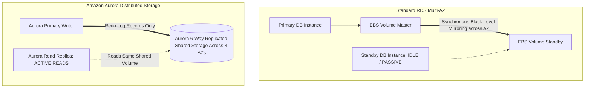

# AWS Relational Database Architecture: RDS and Aurora

## Executive Summary

Amazon Relational Database Service (RDS) and Amazon Aurora provide managed relational database engines. Understanding the fundamental architectural difference between standard RDS and Aurora's log-structured distributed storage engine is critical for sizing and high-availability design.

---

## 1. RDS vs Amazon Aurora Storage Architecture

---

## 2. Aurora Architectural Advantages

1. **Write Amplification Elimination**:
   - Standard RDS writes full database pages, double-write buffers, and WAL logs to EBS.
   - Aurora writes **only redo log records** to a distributed storage fleet replicated 6 ways across 3 AZs. This reduces network I/O by up to 80% and delivers 3–5x the throughput of MySQL/PostgreSQL on identical hardware.
2. **Sub-10ms Read Replica Lag**:
   - Aurora read replicas mount the same underlying distributed storage volume. They do not maintain independent storage copies, reducing replication lag to single-digit milliseconds.
3. **Aurora Global Databases**:
   - Replicates storage blocks asynchronously to secondary AWS regions with average replication lag under 1 second, providing sub-1-minute cross-region RTO and near-zero RPO for disaster recovery.
