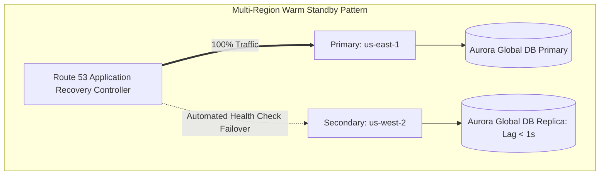

# AWS Disaster Recovery Reference Patterns

## Executive Summary

Designing disaster recovery on AWS requires aligning architectural patterns with business RTO (Recovery Time Objective) and RPO (Recovery Point Objective) mandates.

---

## 1. AWS Disaster Recovery Tiers

---

## 2. Comparative DR Implementation Matrix

| DR Strategy | Implementation on AWS | RTO | RPO | Cost Multiplier |
| :--- | :--- | :--- | :--- | :---: |
| **Backup & Restore** | AWS Backup cross-region replication of EBS snapshots, RDS automated backups, and S3 Glacier copies. | 12–24 Hours | 12–24 Hours | $1.05\times$ |
| **Pilot Light** | Aurora Global Database active replica; core VPC and subnets provisioned via Terraform; compute (ECS/EKS) scaled to zero. | 30–60 Mins | $< 1\text{ Minute}$ | $1.3\times$ |
| **Warm Standby** | Full compute fleet running in secondary region at 20% capacity; Aurora Global Database; auto-scaling triggers on failover. | 5–15 Mins | $< 1\text{ Second}$ | $1.6\times$ |
| **Multi-Region Active-Active**| DynamoDB Global Tables or Aurora Multi-Region; Route 53 ARC latency routing; stateless compute active in both regions. | Sub-minute | Near-Zero | $2.2\times$ |
