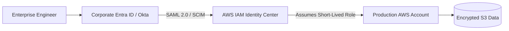

# AWS IAM Architecture & Identity Governance

## Executive Summary

AWS Identity and Access Management (IAM) is the foundational security perimeter. Enterprise IAM architecture enforces the principle of least privilege through **IAM Identity Center (SSO)**, **Permission Boundaries**, and **Temporary Workload Credentials (IAM Roles)**, completely eliminating long-lived access keys.

---

## 1. Identity Federation & Cross-Account Role Assumption

---

## 2. Architectural Guardrails

1. **Elimination of IAM Users & Access Keys**:
   - Human engineers never possess permanent IAM user accounts with access key pairs (`AKIA...`). All interactive access is federated via IAM Identity Center with mandatory multi-factor authentication (MFA).
2. **Permission Boundaries for Delegated Administration**:
   - When granting development teams permission to create IAM roles for Lambda or ECS, attach an **IAM Permission Boundary**. This prevents privilege escalation by ensuring developers cannot create roles with greater privileges than their boundary allows.
3. **ABAC (Attribute-Based Access Control)**:
   - Use tag-based IAM policies (`aws:PrincipalTag/Department = aws:ResourceTag/Department`) to scale authorization without creating thousands of individual bespoke IAM policies.
