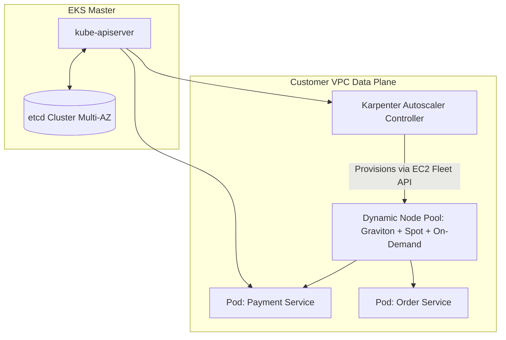

# AWS Kubernetes Architecture: Amazon EKS

## Executive Summary

Amazon Elastic Kubernetes Service (EKS) provides managed Kubernetes control planes across three Availability Zones. At enterprise scale, EKS architecture requires automated node lifecycle management via **Karpenter**, fine-grained IAM via **EKS Pod Identity**, and GitOps deployment pipelines.

---

## 1. Enterprise EKS Topology

---

## 2. Core EKS Architectural Standards

1. **Node Autoscaling via Karpenter (Retiring Cluster Autoscaler)**:
   - Deprecate legacy Cluster Autoscaler and Auto Scaling Groups. Deploy Karpenter to observe unscheduled pods and provision precisely sized, right-priced EC2 instances (mixing Graviton, On-Demand, and Spot) in sub-45 seconds.
2. **EKS Pod Identity (Replacing IRSA)**:
   - Modernize from IAM Roles for Service Accounts (IRSA / OIDC annotations) to **EKS Pod Identity**. EKS Pod Identity simplifies IAM role assumption, eliminates complex OIDC trust policy strings, and operates seamlessly across accounts.
3. **AWS VPC CNI Prefix Delegation**:
   - Configure AWS VPC CNI with `/28` IPv4 prefix delegation to allocate 16 IP addresses per ENI slot, preventing IP exhaustion in enterprise subnets.
