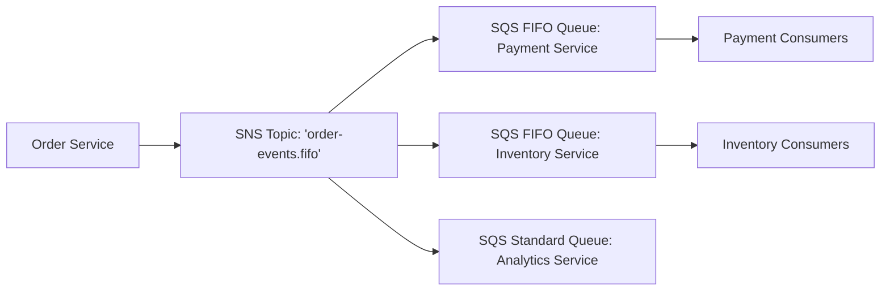

# AWS Messaging Architecture: SQS, SNS, and EventBridge

## Executive Summary

Decoupling microservices requires selecting the appropriate AWS messaging primitive based on delivery guarantees, throughput, and consumer topology.

---

## 1. Messaging Primitives Comparison

| Service | Architectural Role | Message Ordering | Max Consumers | Filtering & Routing |
| :--- | :--- | :--- | :--- | :--- |
| **Amazon SQS** | Queueing / Load Leveling | Standard (Best-effort) or FIFO (Strict) | Pull-based (1 logical consumer queue) | Message attribute routing |
| **Amazon SNS** | Pub/Sub Topic Fanout | Standard or FIFO | Push-based (Up to 12,500,000 subscribers) | Filter policies on attributes |
| **Amazon EventBridge**| Serverless Event Bus | Standard | Push-based (Up to 300 rules per bus) | Complex content-based JSON pattern matching |

---

## 2. Enterprise Fanout Pattern

### Architectural Rules
1. **Always Buffer Pub/Sub with Queues**: Never subscribe an HTTP endpoint or direct compute instance directly to an SNS topic. If downstream compute restarts, messages are dropped. Always place an SQS queue between the SNS topic and the consumer service to provide backpressure and durable buffering.
2. **Dead-Letter Queue (DLQ) & Redrive Policy**: Every production SQS queue must have an associated DLQ with `maxReceiveCount = 3` and automated CloudWatch alarms tracking `ApproximateNumberOfMessagesVisible > 0`.
