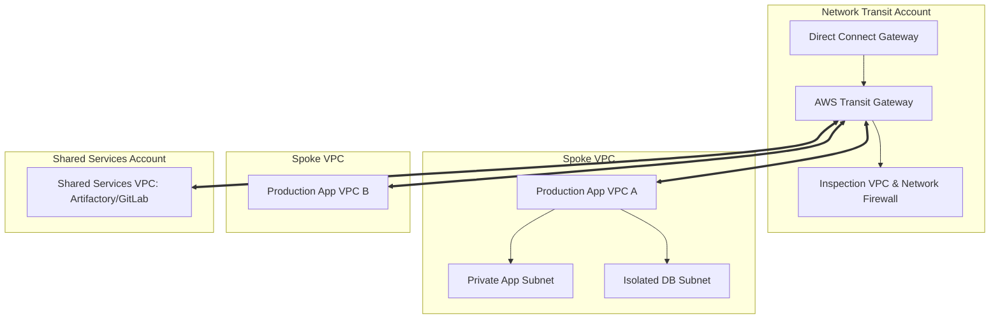

# AWS Networking Architecture: VPC, Transit Gateway & PrivateLink

## Executive Summary

AWS networking architecture organizes IP subnets, routing tables, security groups, and hybrid gateways into an isolated, multi-AZ virtual network.

---

## 1. Enterprise Hub-and-Spoke Transit Architecture

---

## 2. Subnet Tiering & Security Isolation

Every production VPC must be deployed across a minimum of three Availability Zones with three distinct tiers:

1. **Public / Ingress Subnets**:
   - Contains Application Load Balancers (ALBs) and NAT Gateways. Direct route to Internet Gateway (`0.0.0.0/0 -> igw-xxxx`).
   - Zero application servers or database instances are permitted in public subnets.
2. **Private Application Subnets**:
   - Contains ECS tasks, EKS worker nodes, and Lambda ENIs. Outbound internet egress routed through NAT Gateways in the public tier. Inbound traffic allowed only from the ALB security group.
3. **Isolated Database Subnets**:
   - Contains RDS, Aurora, and ElastiCache clusters. **Zero internet routing** (no route to IGW or NAT Gateway). Accessible solely from the private application tier over dedicated database ports (e.g., 5432).
4. **AWS PrivateLink for Provider Services**:
   - Access AWS services (S3, Secrets Manager, CloudWatch) via VPC Interface Endpoints, keeping traffic on the private AWS network and eliminating NAT Gateway data processing fees.
