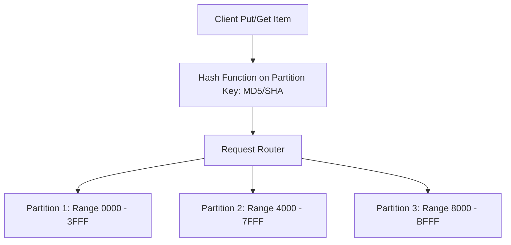

# AWS NoSQL Architecture: Amazon DynamoDB

## Executive Summary

Amazon DynamoDB is a fully managed, serverless, key-value and document NoSQL database designed for single-digit millisecond latency at any scale. Achieving optimal performance and cost requires mastering **Partition Key design** and **Single-Table Design**.

---

## 1. DynamoDB Partitioning & Sharding Architecture

### Partition Limits
Each physical DynamoDB partition is hard-capped at:
- **1,000 Write Capacity Units (WCU)** = $1,000 \text{ writes/sec}$ ($1\text{ KB}$ item size).
- **3,000 Read Capacity Units (RCU)** = $3,000 \text{ strongly consistent reads/sec}$ ($4\text{ KB}$ item size).
- **10 GB of storage**.

> **Architectural Guardrail: Avoid Hot Partitions**: If an application writes to a partition key based on an enum with low cardinality (e.g., `status = "PENDING"`), all writes flood a single physical partition, triggering `ProvisionedThroughputExceededException` even if total table capacity is barely utilized.

---

## 2. Core Enterprise Design Patterns

1. **Single-Table Design**:
   - Consolidate multiple relational entities (e.g., Customers, Orders, OrderItems) into a single DynamoDB table using generic partition keys (`PK`) and sort keys (`SK`) with overloaded Global Secondary Indexes (GSIs). This retrieves complex parent-child entity graphs in a single network round-trip (`Query` API).
2. **DynamoDB Global Tables**:
   - Active-active multi-region replication with automatic multi-master conflict resolution based on Last-Writer-Wins (LWW). Ideal for global user profiles and session storage.
