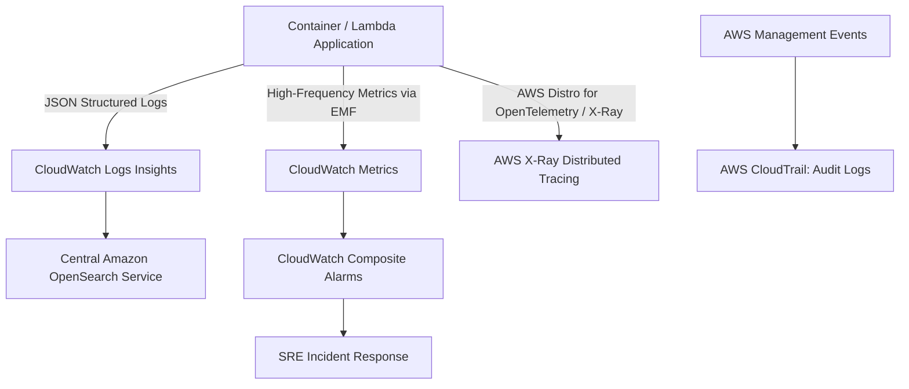

# AWS Observability Architecture: CloudWatch, X-Ray & CloudTrail

## Executive Summary

Observability in AWS encompasses infrastructure metrics, structured application logs, distributed traces, and security audit trails.

---

## 1. Unified Telemetry Flow

---

## 2. Architectural Best Practices

1. **Embedded Metric Format (EMF)**:
   - Do not make synchronous `PutMetricData` API calls from application request paths; this introduces network latency and incurs high API charges.
   - Emit metrics as structured JSON logs using AWS Embedded Metric Format (EMF). CloudWatch automatically extracts and indexes the metrics asynchronously with zero performance overhead.
2. **CloudTrail Log File Integrity Validation**:
   - Enable CloudTrail digest files in the Central Log Archive account. This cryptographically signs log files using SHA-256 and RSA, providing mathematically provable non-repudiation for security compliance audits.
