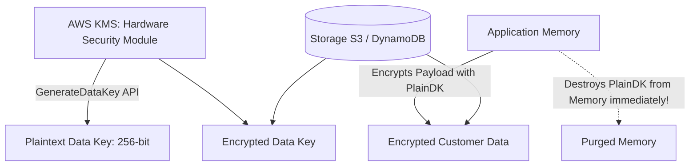

# AWS Security: KMS Envelope Encryption & Secrets Management

## Executive Summary

Enterprise security requires encrypting all data at rest and in transit. AWS Key Management Service (KMS) and AWS Secrets Manager provide hardware security module (HSM) backed cryptographic key storage and automated credential rotation.

---

## 1. KMS Envelope Encryption Architecture

### Why Envelope Encryption?
- Passing gigabytes of raw data over the network to KMS for encryption is slow and throttles KMS API quotas.
- Envelope encryption encrypts data locally using a fast symmetric Data Encryption Key (DEK). Only the 256-bit DEK is encrypted by the root Customer Master Key (CMK) inside the KMS HSM.

---

## 2. Secrets Manager vs Systems Manager Parameter Store

| Capability | AWS Secrets Manager | SSM Parameter Store (Advanced) |
| :--- | :--- | :--- |
| **Primary Use Case** | Database passwords, third-party API tokens, rotating credentials | Static application configs, environment strings, license keys |
| **Automatic Rotation** | Built-in native Lambda rotation for RDS, Aurora, DocumentDB | Requires custom Lambda orchestration |
| **Cross-Account Secret Sharing**| Native cross-account resource policies | Requires IAM role assumption |
| **Pricing** | $\$0.40 \text{ per secret/month} + \$0.05 / 10\text{k API calls}$ | Standard: Free; Advanced: $\$0.05 \text{ per secret/month}$ |
