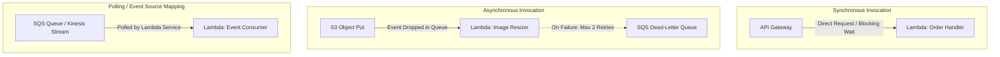

# AWS Serverless Architecture: AWS Lambda

## Executive Summary

AWS Lambda executes code in response to events without provisioning or managing servers. It scales automatically from zero to thousands of concurrent executions, billing per millisecond of compute time.

---

## 1. Lambda Invocation Models

---

## 2. Architectural Guardrails & Concurrency

1. **Cold Start Optimization**:
   - Use compiled lightweight runtimes (Go, Rust, Node.js, Python).
   - For Java/.NET workloads, enable **SnapStart** (Firecracker microVM snapshotting) to reduce cold starts from 6 seconds to $< 200\text{ ms}$.
2. **Reserved vs Provisioned Concurrency**:
   - **Reserved Concurrency**: Acts as a ceiling to prevent a runaway Lambda function from exhausting the regional account concurrency limit (default 1,000) and starving critical services.
   - **Provisioned Concurrency**: Pre-warms microVM execution environments to eliminate cold starts entirely for latency-critical APIs.
3. **Database Connection Management**:
   - Never allow hundreds of concurrent Lambda instances to open direct connections to relational databases (PostgreSQL/MySQL), which exhausts database thread pools. Deploy **AWS RDS Proxy** to pool and multiplex database connections.
