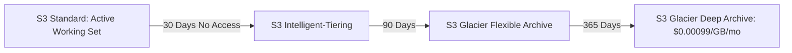

# AWS Storage Architecture: S3, EBS, and EFS

## Executive Summary

Selecting the appropriate storage service requires matching application I/O patterns, latency tolerances, sharing requirements, and durability expectations.

---

## 1. Storage Selection Matrix

| Storage Service | Architecture Type | Latency Profile | Max Throughput | Access Model |
| :--- | :--- | :--- | :--- | :--- |
| **Amazon S3** | Object Storage | $50 - 100\text{ ms}$ First-byte | Virtually unlimited (scales with prefix) | REST API (HTTP GET/PUT) |
| **Amazon EBS (gp3)** | Block Storage | Sub-millisecond to $2\text{ ms}$ | Up to $1,000\text{ MB/s}$ / $16,000\text{ IOPS}$ | Single EC2 instance attach |
| **Amazon EBS (io2 Block Express)**| High-Perf Block | Sub-millisecond ($< 0.2\text{ ms}$) | Up to $4,000\text{ MB/s}$ / $256,000\text{ IOPS}$| SAN replacement for Oracle/SAP |
| **Amazon EFS** | Distributed File (NFSv4) | $2 - 5\text{ ms}$ | Up to $10\text{ GB/s}$ / Elastic | Multi-instance / Multi-AZ shared |

---

## 2. Amazon S3 Lifecycle & Security Architecture

### Critical S3 Enterprise Rules
- **Block Public Access**: Enforce account-level S3 Block Public Access via SCP to make it impossible to accidentally expose buckets to the internet.
- **KMS SSE-KMS Encryption**: Mandate AWS Key Management Service encryption (`aws:kms`) with customer-managed keys (CMK) and bucket keys to reduce KMS API costs by 99%.
