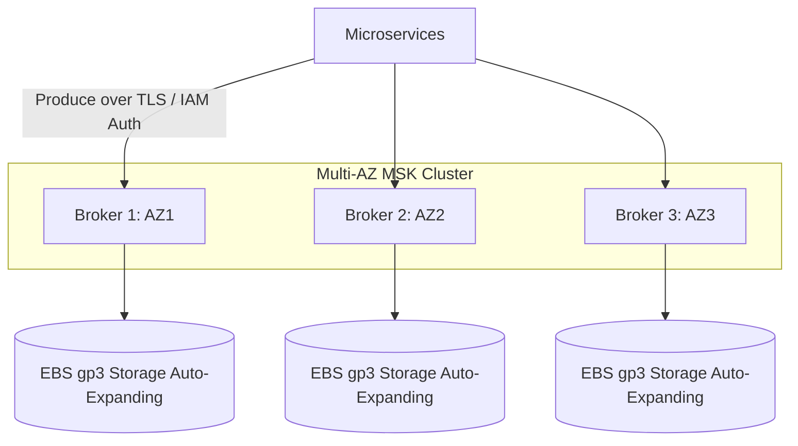

# AWS Event Streaming: Amazon MSK (Managed Kafka)

## Executive Summary

Amazon Managed Streaming for Apache Kafka (Amazon MSK) provides a fully managed, enterprise-grade Apache Kafka service. It eliminates the toil of zookeeper/kraft quorum management, broker hardware provisioning, and OS patching.

---

## 1. Amazon MSK Deployment Topology

---

## 2. MSK Provisioned vs MSK Serverless

| Architectural Dimension | Amazon MSK Provisioned | Amazon MSK Serverless |
| :--- | :--- | :--- |
| **Capacity Management** | Manual broker instance sizing (`kafka.m5.large` to `kafka.m7g.16xlarge`) | Fully automated; scales partitions and bandwidth on-demand |
| **Storage Management** | Automated storage volume auto-expansion | Automated storage scaling up to 8 TB per partition |
| **Partition Ceiling** | Thousands of partitions per broker | Up to 2,400 partitions per cluster |
| **Cost Model** | Hourly fee per broker + EBS storage fee | Per-cluster-hour + per-MB-in/out + per-partition-hour |
| **Best Suited For** | Predictable, continuous high-throughput ($> 200\text{ MB/s}$); custom Kafka configurations | Bursty, unpredictable event streams; lightweight internal microservice integration |
