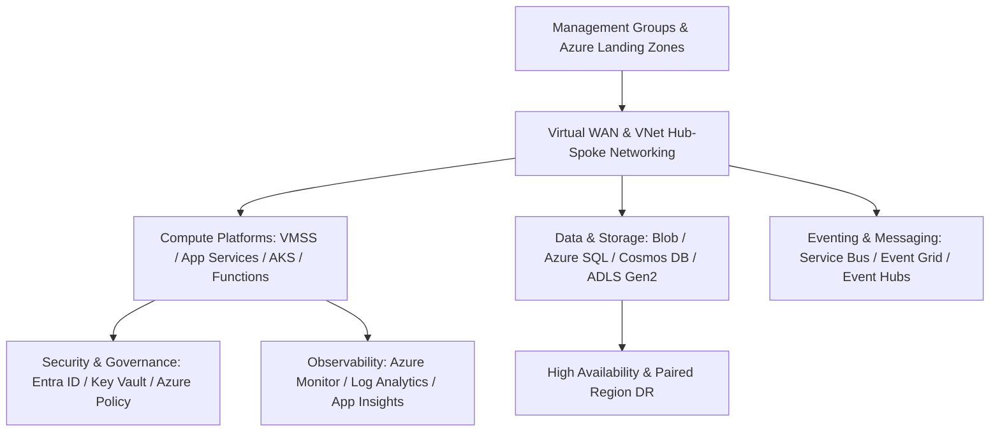

# Azure Architecture: Enterprise Capabilities & Patterns

## Executive Summary

This section provides architectural blueprints and decision frameworks for designing enterprise platforms on Microsoft Azure. It is structured around **architectural capabilities**, evaluated through trade-offs, scaling limits, failure modes, security implications, and cost models aligned with the **Microsoft Cloud Adoption Framework (CAF)** and **Azure Well-Architected Framework**.

---

## Azure Architectural Capabilities Map

---

## Architecture Blueprints & Guides

| Capability Area | Document | Core Focus & Architectural Evaluation |
| :--- | :--- | :--- |
| **Landing Zone & Hierarchy**| **[Subscription Strategy](subscription-strategy.md)** | Management Groups, Subscriptions, Azure Landing Zones (ALZ) |
| **Identity & Access** | **[Entra ID & IAM](entra-id-and-iam.md)** | Microsoft Entra ID, PIM, Conditional Access, Managed Identities |
| **Networking** | **[Networking & VNet](networking-vnet.md)** | Virtual WAN, VNet Peering, Private Endpoints, NSGs, Firewall |
| **Virtual Compute** | **[Compute: VM Scale Sets](compute-vmss.md)** | Virtual Machines, VMSS autoscaling, Spot VMs, Proximity Groups |
| **Managed PaaS** | **[App Services](app-services.md)** | App Service Plans, Deployment Slots, Isolated V2, Private Link |
| **Managed Kubernetes** | **[Kubernetes: AKS](kubernetes-aks.md)** | AKS architecture, Azure CNI Overlay, Workload Identity, KEDA |
| **Serverless Compute** | **[Serverless: Azure Functions](serverless-functions.md)**| Consumption vs Premium, Durable Functions, State orchestration |
| **Storage Tier** | **[Storage: Blob & Files](storage-blob-files.md)** | Blob hot/cool/archive, Azure Files NFS/SMB, ADLS Gen2 |
| **Relational Databases** | **[Databases: Azure SQL](databases-azure-sql.md)** | SQL Database, Managed Instance, Hyperscale, Geo-Replication |
| **NoSQL Databases** | **[NoSQL: Cosmos DB](nosql-cosmos-db.md)** | 5 Consistency Levels, Partition Keys, Global Distribution, RU/s |
| **In-Memory Caching** | **[Caching: Azure Redis](caching-redis.md)** | Azure Cache for Redis, Enterprise Clustering, Active Geo-Replication |
| **Enterprise Messaging** | **[Messaging: Service Bus & Event Grid](messaging-service-bus-event-grid.md)**| Service Bus queues/topics, Sessions, Event Grid reactive push |
| **Streaming Platform** | **[Streaming: Event Hubs](streaming-event-hubs.md)** | Partition architecture, Kafka surface, Event Hubs Capture |
| **API Management** | **[API Management (APIM)](api-management.md)** | XML policies, Developer portal, Self-hosted gateway, mTLS |
| **Secrets & Encryption** | **[Security: Key Vault & HSM](security-key-vault.md)** | Managed HSM, Envelope encryption, Managed Identity access |
| **Observability** | **[Observability: Azure Monitor](observability-monitor.md)** | Log Analytics Workspaces, Application Insights, KQL queries |
| **Disaster Recovery** | **[Disaster Recovery Patterns](disaster-recovery.md)** | Availability Zones, Paired Regions, Azure Site Recovery, Front Door |
