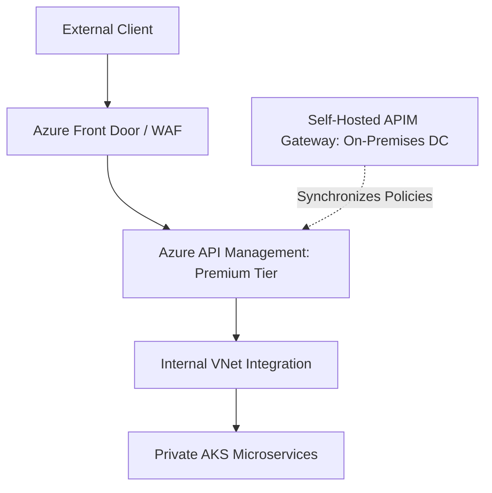

# Azure API Management (APIM) Architecture

## Executive Summary

Azure API Management (APIM) provides an enterprise-grade API gateway, developer portal, and policy enforcement engine.

---

## 1. APIM Deployment Topologies

---

## 2. APIM Policy Processing Pipeline

APIM policies are configured via XML and executed in four processing stages:
1. **`<inbound>`**: Validate JWT signatures, enforce rate limits (`rate-limit-by-key`), translate headers, enforce mTLS client certificates.
2. **`<backend>`**: Route requests to target microservices, manage HTTP connection pooling, handle retry loops with exponential backoff.
3. **`<outbound>`**: Strip sensitive internal server headers, apply response body masking (PII masking), convert XML to JSON.
4. **`<on-error>`**: Generate standardized RFC 7807 Problem Details error payloads.
