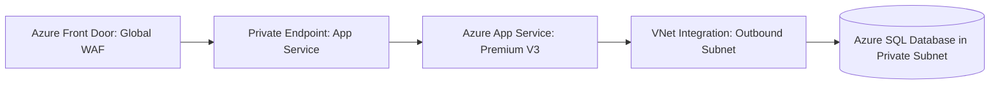

# Azure App Services Architecture

## Executive Summary

Azure App Service is a fully managed HTTP-based platform for hosting web applications, REST APIs, and mobile backends across .NET, Java, Node.js, and Python.

---

## 1. Enterprise App Service Topology

---

## 2. Architectural Guardrails

1. **Regional VNet Integration (Outbound)**:
   - By default, App Service calls outbound resources over the public internet. Enforce **VNet Integration** so that all outbound database queries, Redis calls, and API integrations route exclusively through a dedicated private VNet subnet.
2. **Zero-Downtime Deployment Slots**:
   - Utilize staging deployment slots for blue/green validation. Warm up the application runtime in the staging slot, verify health checks, and execute a metadata swap to redirect production traffic with zero downtime.
3. **App Service Environment (ASE v3)**:
   - For highly regulated workloads requiring complete physical hardware isolation and dedicated virtual networks, deploy App Service Environment v3 (ASEv3).
