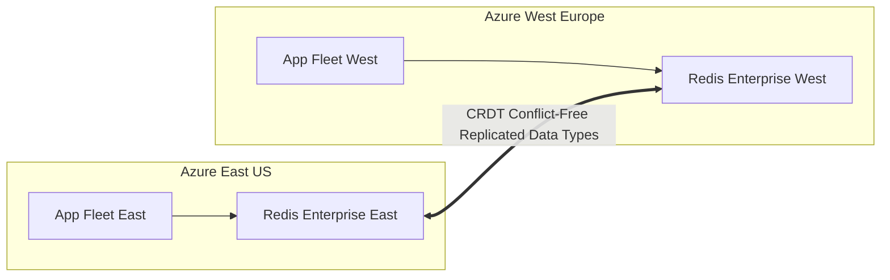

# Azure In-Memory Caching: Azure Cache for Redis

## Executive Summary

Azure Cache for Redis provides fully managed Redis implementations. At enterprise scale, **Azure Managed Redis (Enterprise Tier)** leverages Redis Enterprise technology for multi-region active-active replication and flash memory tiering.

---

## 1. Azure Redis Enterprise Active-Active Topology

---

## 2. Enterprise Caching Patterns

1. **Active-Active Geo-Replication (CRDTs)**:
   - Uses Conflict-Free Replicated Data Types (CRDTs) to allow seamless read and write operations in multiple Azure regions simultaneously with automated local conflict resolution.
2. **Redis on Flash (RoF)**:
   - Extends RAM storage onto high-speed NVMe SSDs, reducing per-gigabyte caching costs by up to 70% for massive working sets ($> 500\text{ GB}$).
3. **Data Loss Prevention**:
   - Enable Redis AOF (Append-Only File) persistence or RDB snapshots with replication across Availability Zones (Zone Redundant tier).
