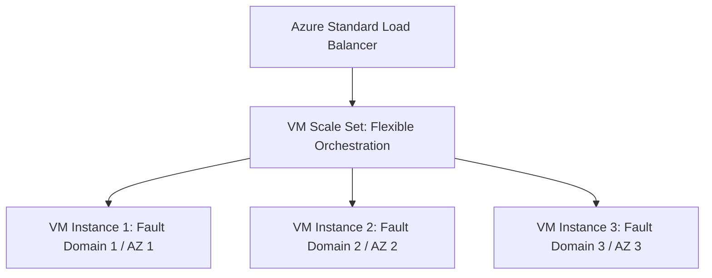

# Azure Compute: Virtual Machines & Scale Sets (VMSS)

## Executive Summary

Azure Virtual Machine Scale Sets (VMSS) provide automated deployment, load balancing, and scaling of identical groups of virtual machines.

---

## 1. VMSS Architecture & Availability Topologies

---

## 2. Flexible vs Uniform Orchestration

- **Uniform Orchestration (Legacy)**: High-scale compute clusters with identical configurations, optimized for stateless batch processing.
- **Flexible Orchestration (Modern Standard)**: Treats VMs as first-class citizens within the scale set. Allows mixing instance sizes, mixing Spot and On-Demand instances, and attaching dedicated availability guarantees across fault domains.

### Proximity Placement Groups (PPG)
For ultra-low-latency distributed systems (e.g., SAP HANA or custom cluster consensus), bind VMSS instances to a **Proximity Placement Group**. This physically collocates VMs within the same data center room, reducing network RTT to sub-0.3 milliseconds at the expense of regional resilience.
