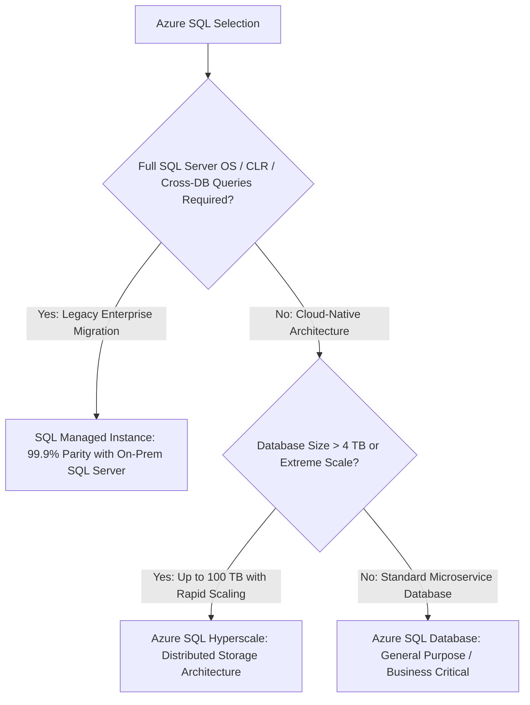

# Azure Relational Database Architecture: Azure SQL & Hyperscale

## Executive Summary

Azure provides enterprise-grade relational database hosting through **Azure SQL Database (Single/Elastic Pool)**, **Azure SQL Managed Instance**, and **Azure SQL Hyperscale**.

---

## 1. Azure SQL Deployment Models

---

## 2. Azure SQL Hyperscale Architecture

Hyperscale completely decouples the compute tier from distributed storage:
- **Compute Tier**: Stateless compute nodes serving queries and maintaining local SSD page caches. Read replicas can be provisioned in minutes regardless of database size.
- **Page Servers**: Distributed pool of multi-terabyte SSD caching nodes.
- **Log Service**: Microsecond log-write engine distributing transactions to long-term Azure storage.
- **Architectural Consequence**: Backups are instantaneous snapshots; database restore operations take under 10 minutes whether the database is 500 GB or 80 TB.
