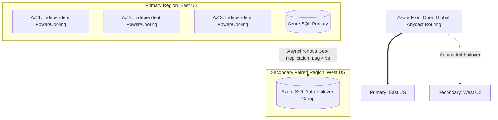

# Azure Disaster Recovery: Paired Regions and Resiliency Patterns

## Executive Summary

Designing disaster recovery on Azure leverages **Availability Zones (AZs)** for intra-region high availability and **Azure Paired Regions** for geographic disaster recovery.

---

## 1. Regional Resiliency Hierarchy

---

## 2. Azure Paired Region Advantages

1. **Sequential Updates**: Azure never updates platform software in both paired regions simultaneously; updates roll out sequentially to prevent global patch-induced outages.
2. **Physical Separation**: Paired regions are separated by at least 300 miles to survive regional disasters (weather events, civil disruption).
3. **Data Residency**: Regional pairs reside within the same geopolitical tax and legal boundary (with the exception of Brazil South).
