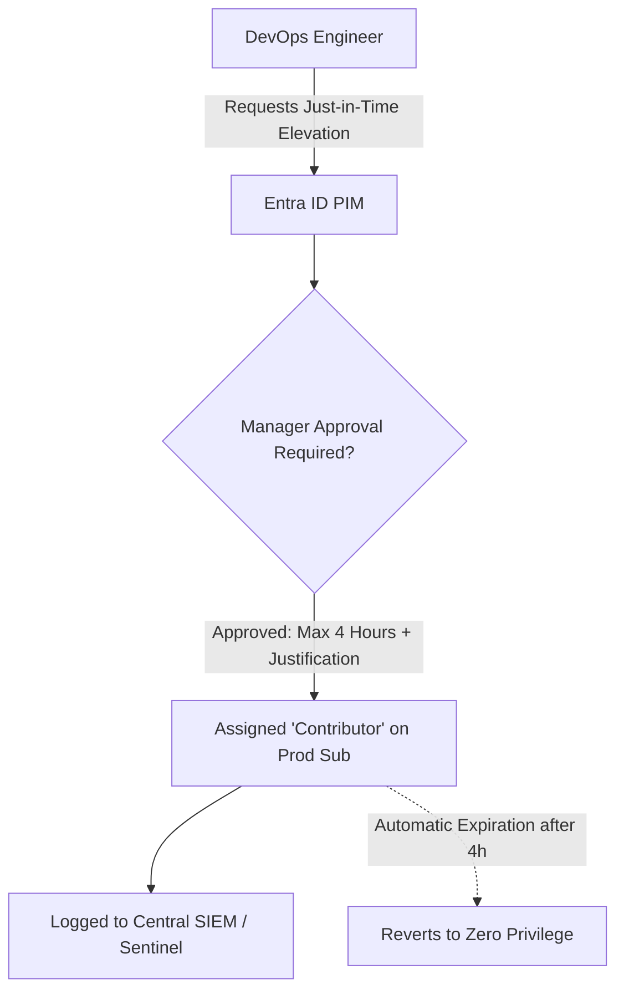

# Microsoft Entra ID & Enterprise IAM Architecture

## Executive Summary

Microsoft Entra ID (formerly Azure Active Directory) is the cloud identity and access management backbone for Microsoft Azure and Microsoft 365. Enterprise architecture leverages **Privileged Identity Management (PIM)**, **Conditional Access**, and **Managed Identities** to eliminate standing privileges.

---

## 1. Zero Standing Access with Privileged Identity Management (PIM)

---

## 2. Workload Identities: Azure Managed Identities

Human credentials must never be embedded in application configuration files. Azure provides **Managed Identities** for Azure resources:
- **System-Assigned Managed Identity**: Tied 1:1 to a specific Azure resource lifecycle (e.g., an App Service or VM). When the resource is deleted, the identity is automatically deleted.
- **User-Assigned Managed Identity**: Independent Azure resource assigned to multiple compute instances (e.g., across an autoscaling VMSS fleet).

Applications acquire short-lived OAuth 2.0 access tokens directly from the local Azure instance metadata service (`http://169.254.169.254/metadata/identity/oauth2/token`) to authenticate against Key Vault, Azure SQL, and Service Bus with zero secrets management code.
