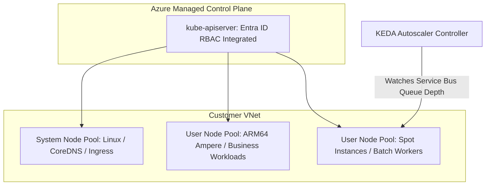

# Azure Kubernetes Service (AKS) Architecture

## Executive Summary

Azure Kubernetes Service (AKS) delivers enterprise-grade managed Kubernetes. At scale, AKS architecture requires **Azure CNI Overlay networking**, **Azure Workload Identity**, and event-driven autoscaling via **KEDA**.

---

## 1. Enterprise AKS Architecture Blueprint

---

## 2. Critical AKS Standards

1. **Azure CNI Overlay (Preventing IP Exhaustion)**:
   - Traditional Azure CNI allocates a private VNet IP to every pod, exhausting enterprise subnet CIDRs (`/20` subnets consumed in days).
   - Standardize on **Azure CNI Overlay**: Assigns private internal overlay IPs (`192.168.0.0/16`) to pods while allocating VNet IPs only to physical worker nodes.
2. **Azure Workload Identity**:
   - Binds Kubernetes Service Accounts directly to Microsoft Entra ID Managed Identities using OIDC token exchange, eliminating stored secrets.
3. **KEDA (Kubernetes Event-driven Autoscaling)**:
   - Autoscale application pods based on external metrics (e.g., Azure Service Bus queue length, Kafka consumer group lag) rather than sluggish CPU/memory thresholds.
