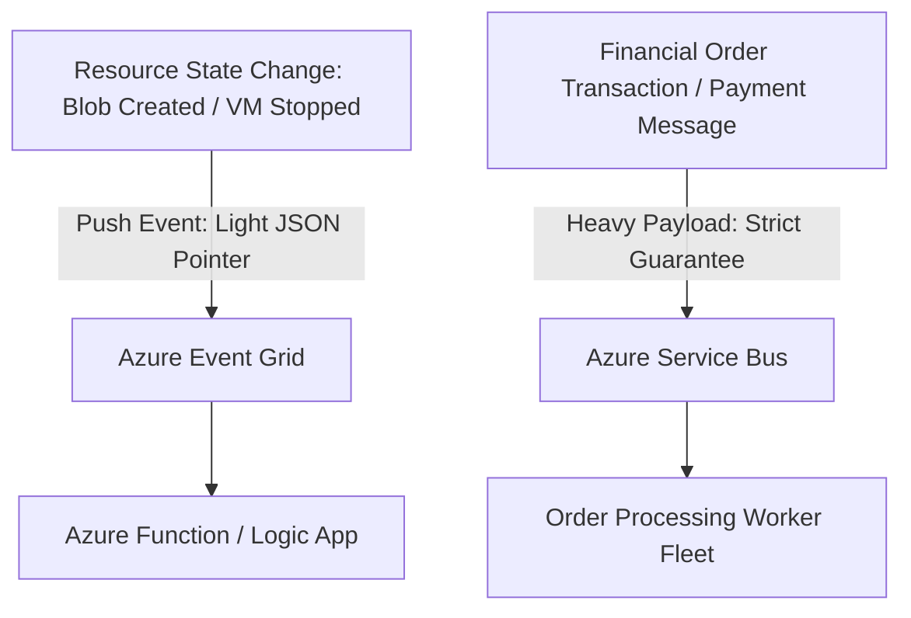

# Azure Messaging Architecture: Service Bus and Event Grid

## Executive Summary

Enterprise messaging on Azure is divided into **Enterprise Message Brokering** (Azure Service Bus) and **Reactive Event Routing** (Azure Event Grid).

---

## 1. Service Bus vs Event Grid Architectural Distinction

| Dimension | Azure Service Bus (Premium) | Azure Event Grid |
| :--- | :--- | :--- |
| **Model Type** | Enterprise Message Broker (Pulls & Transacts) | Reactive Event Dispatcher (Push-Push) |
| **Payload Size** | Up to 100 MB (Large Message Support) | Lightweight JSON ($< 1\text{ MB}$) |
| **Delivery Guarantees**| At-Least-Once, Peek-Lock, Duplicate Detection | At-Least-Once with automatic exponential retry |
| **Message Ordering** | Strict FIFO via **Message Sessions** | Out of order (Event timestamps) |
| **Dead-Lettering** | Native sub-queue DLQ per subscription | Dead-letter storage container in Azure Blob |

---

## 2. Enterprise Message Sessions for Ordered Processing

To guarantee strict in-order processing across a distributed consumer fleet without limiting throughput to a single thread:
- Set `SessionId = customer_id` on the message.
- Multiple consumers process the same queue concurrently; however, each consumer locks a specific `SessionId`, guaranteeing strict sequential processing per customer while scaling horizontally across thousands of customers.
