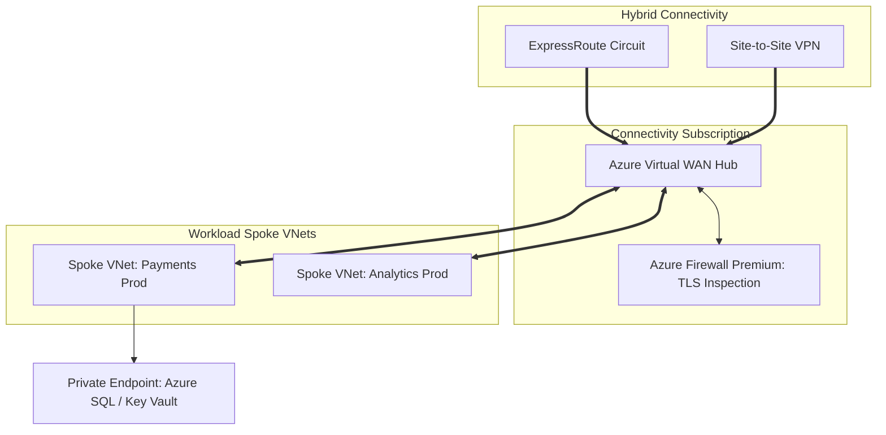

# Azure Networking Architecture: Virtual WAN, VNets & Private Endpoints

## Executive Summary

Azure Virtual Network (VNet) provides network isolation. Modern enterprise architecture standardizes on **Azure Virtual WAN** as a managed hub-and-spoke transit network, paired with **Azure Private Endpoints** to completely isolate PaaS data services from the public internet.

---

## 1. Azure Virtual WAN Hub-and-Spoke Topology

---

## 2. Private Endpoints vs Service Endpoints

| Architecture Dimension | Azure Service Endpoints | Azure Private Endpoints (Private Link) |
| :--- | :--- | :--- |
| **IP Addressing** | Traffic exits VNet using Microsoft backbone; target retains public IP. | Assigns a private IP from the local VNet subnet (`10.x.x.x`). |
| **Routing Scope** | Direct from single VNet only; cannot traverse on-premises VPN/ExpressRoute. | Accessible from on-premises data centers via ExpressRoute and peered VNets. |
| **Data Exfiltration Risk**| Potential risk of accessing unauthorized public tenant storage accounts. | Locks connectivity strictly to a specific, authorized Azure resource instance. |
| **Architectural Verdict** | Legacy pattern; deprecated for regulated workloads. | **Mandatory Enterprise Standard** for all PaaS data services. |
