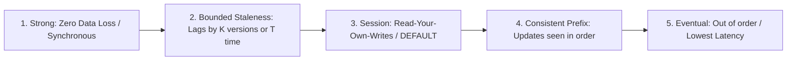

# Azure NoSQL Architecture: Azure Cosmos DB

## Executive Summary

Azure Cosmos DB is a globally distributed, multi-model NoSQL database offering single-digit millisecond read/write latencies at the 99th percentile with a 99.999% SLA.

---

## 1. The Five Consistency Levels

Cosmos DB replaces the binary ACID vs Eventual Consistency choice with five distinct consistency models:

### Consistency Trade-Off Matrix

| Consistency Level | RPO (Data Loss Risk) | Latency Profile | Multi-Region Write Support |
| :--- | :--- | :--- | :--- |
| **Strong** | **Zero RPO** | High (synchronous cross-region wait) | Single-region write only |
| **Bounded Staleness** | Bound to max 5 minutes or 100,000 updates | Low within region; predictable WAN delay | Single-region write only |
| **Session** (Recommended) | Bound to client session | Ultra-low (sub-10ms) | Supported across all regions |
| **Eventual** | Non-deterministic | Lowest latency; lowest RU consumption | Supported across all regions |

---

## 2. Partition Key Design & Request Units (RU/s)

- **Request Units (RU/s)**: Abstract currency of compute, memory, and IOPS. A 1 KB document point-read consumes 1 RU.
- **Partition Key Selection**: Must possess high cardinality (thousands of unique values) and distribute write volume evenly to avoid hot partitions. Never partition by an enum (e.g., `status = "ACTIVE"`).
