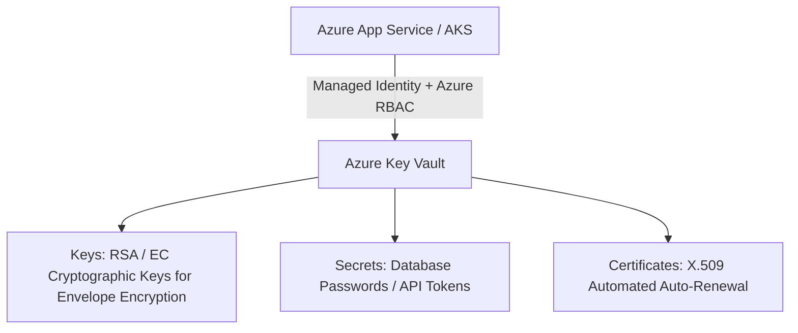

# Azure Security: Key Vault and Managed HSM

## Executive Summary

Azure Key Vault provides secure cryptographic key storage, secret management, and SSL/TLS certificate lifecycle automation. For banking and defense workloads, **Azure Key Vault Managed HSM** provides FIPS 140-2 Level 3 validated single-tenant hardware security modules.

---

## 1. Key Vault Objects & RBAC Architecture

---

## 2. Security Guardrails

1. **Azure RBAC Authorization Model**:
   - Deprecate legacy Key Vault Access Policies. Enforce the **Azure RBAC** permission model (`Key Vault Secrets User`, `Key Vault Crypto Officer`) for granular role assignment scoped to individual secrets or keys.
2. **Soft Delete & Purge Protection**:
   - Mandate **Soft Delete** (90-day retention) and **Purge Protection** across all production Key Vaults. This prevents rogue administrators or compromised automation scripts from permanently destroying encryption keys.
3. **Private Endpoint Isolation**:
   - Disable public network access (`publicNetworkAccess = "Disabled"`); route all Key Vault API traffic over Private Endpoints within private VNets.
