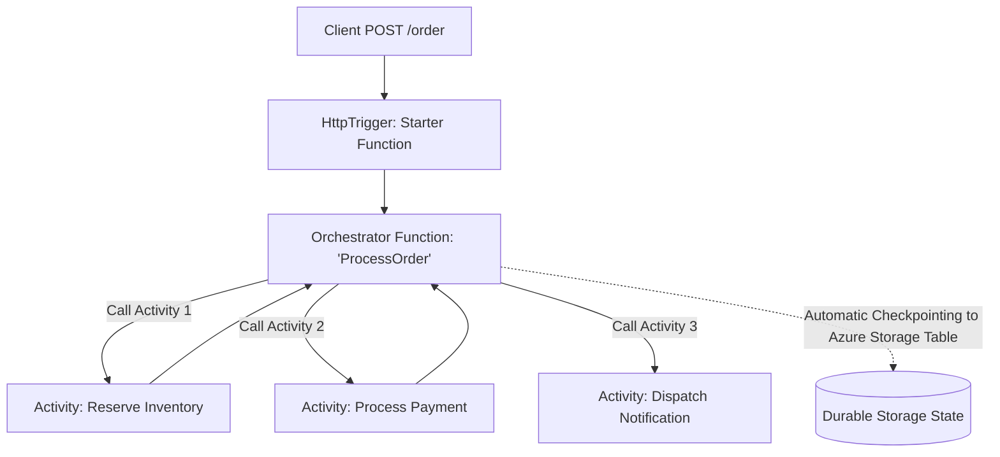

# Azure Serverless Architecture: Azure Functions & Durable Functions

## Executive Summary

Azure Functions provides event-driven serverless compute. For complex multi-step distributed workflows, **Durable Functions** introduces code-centric stateful orchestration without external databases.

---

## 1. Durable Functions State Orchestration Pattern

---

## 2. Hosting Plan Selection

| Dimension | Consumption Plan | Premium Plan (Elastic) | Dedicated (App Service) Plan |
| :--- | :--- | :--- | :--- |
| **Cold Starts** | Substantial (seconds on idle) | Zero cold starts (pre-warmed instances) | Zero cold starts |
| **VNet Integration** | Not supported | Supported (Private VNet connectivity) | Supported |
| **Max Execution Duration**| 5 to 10 Minutes | Guaranteed up to 60 minutes | Unlimited |
| **Billing Model** | Pure pay-per-execution + GB-seconds | Base hourly rate per pre-warmed instance | Predictable monthly VM rate |
| **Enterprise Verdict** | Internal dev/test and low-priority cron jobs | **Standard for enterprise APIs and VNet-connected workers** | Suitable when consolidating with existing App Service fleets |
