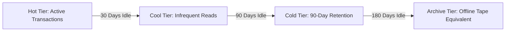

# Azure Storage Architecture: Blob, Files & ADLS Gen2

## Executive Summary

Azure Storage provides scalable cloud object, file, and data lake storage. Selecting the appropriate storage capability is governed by data access patterns, file sharing protocols (NFS/SMB), and analytical performance.

---

## 1. Storage Services Comparison

| Service / Tier | Primary Protocol | Optimal Workload | Durability Options |
| :--- | :--- | :--- | :--- |
| **Azure Blob (Hot/Cool/Archive)** | REST / HTTPS | Unstructured images, documents, backups | LRS (Local), ZRS (Zone), GZRS (Geo-Zone) |
| **Azure Data Lake Storage Gen2 (ADLS Gen2)**| ABFS / Hadoop | Big Data Analytics (Databricks, Synapse, Snowflake) | Hierarchical Namespace (POSIX ACLs) |
| **Azure Files (Standard / Premium)** | SMB 3.0 / NFS v4.1 | Lift-and-shift legacy file shares, container PVs | Premium SSD for sub-5ms low-latency shares |
| **Azure NetApp Files** | Enterprise NFS / SMB | SAP HANA, high-performance Oracle on Azure | Extreme performance: up to 450,000 IOPS |

---

## 2. Enterprise Data Tiering Architecture

### Critical Azure Storage Guardrails
- **Immutable Storage with WORM**: Enable time-based retention policies and legal hold locks on Blob storage to comply with SEC Rule 17a-4 and FINRA requirements.
- **Zone-Redundant Storage (ZRS)**: Mandate ZRS as the minimum baseline for production storage accounts to survive the total failure of an Azure data center facility.
