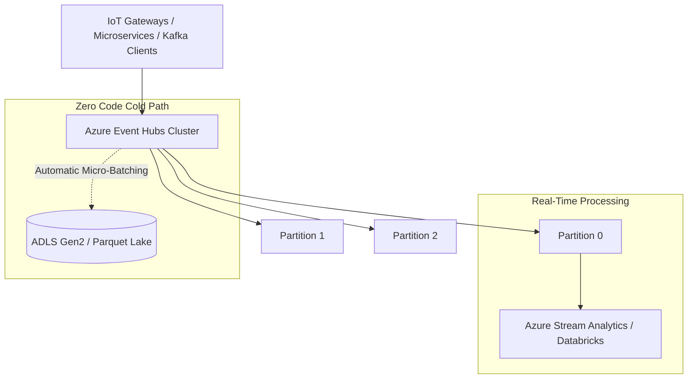

# Azure Event Streaming: Azure Event Hubs

## Executive Summary

Azure Event Hubs is a fully managed, real-time data ingestion service capable of streaming millions of events per second. It provides a native **Apache Kafka API surface**, allowing existing Kafka applications to connect without code changes.

---

## 1. Event Hubs Ingestion & Capture Topology

---

## 2. Architectural Best Practices

1. **Event Hubs Capture**:
   - Eliminate custom consumer code for cold-path archiving. Enable Event Hubs Capture to automatically dump streaming events into Azure Blob or ADLS Gen2 in Avro/Parquet format partitioned by date/hour.
2. **Partition Count Permanence**:
   - Partition count determines downstream consumer parallelism. In Standard tier, partition counts cannot be changed after creation. Size partitions upfront based on peak sustained throughput (1 Partition = $1\text{ MB/s}$ Ingress, $2\text{ MB/s}$ Egress).
