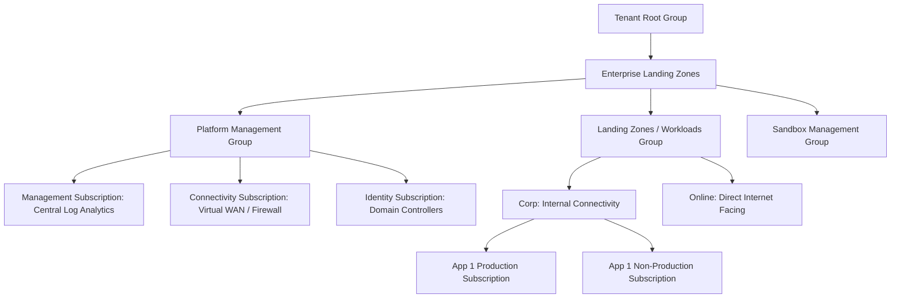

# Azure Subscription Strategy & Management Group Hierarchy

## Executive Summary

Azure organizes resources within a hierarchy: **Management Groups $\rightarrow$ Subscriptions $\rightarrow$ Resource Groups $\rightarrow$ Resources**. In enterprise architecture, subscriptions act as the primary boundary for **billing**, **access control (RBAC)**, and **quota management**.

---

## 1. Enterprise Management Group Hierarchy (Azure Landing Zone)

---

## 2. Subscription Sizing & Quota Boundaries

- **Subscription Limits**: Azure enforces hard limits per subscription (e.g., maximum 800 Resource Groups, maximum 25,000 virtual machines).
- **Scale-Out Subscriptions**: Never pack an entire enterprise into a single subscription. Follow the Azure Landing Zone (ALZ) pattern: dedicate individual subscriptions per application per environment (e.g., `sub-payments-prod-001`, `sub-payments-nonprod-001`).
- **Azure Policy Inheritance**: Assign policies at the Management Group level (e.g., `Enforce-Encryption-In-Transit`, `Deny-Public-IPs`) so they automatically propagate down to all present and future child subscriptions.
