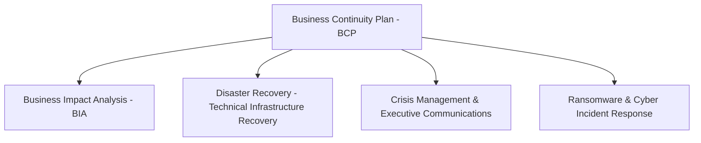

# Business Continuity Planning (BCP) & Dependency Architecture

## Executive Summary

Business Continuity Planning (BCP) is the holistic governance framework ensuring that critical enterprise business operations can continue functioning during major disruptions—including cloud infrastructure outages, cyberattacks, facility loss, and vendor insolvency.

---

## Business Continuity Framework

---

## Deliverables & Guides

| Document | Focus Area | Architectural Impact |
| :--- | :--- | :--- |
| **[BCP vs DR](bcp-vs-dr.md)** | Conceptual boundaries | Distinguishing BCP, DR, Crisis Management, Incident Management |
| **[Business Impact Analysis (BIA)](business-impact-analysis.md)**| Service tiering | Tiering business services, identifying maximum tolerable downtime (MTD) |
| **[Dependency Mapping](dependency-mapping.md)** | Critical paths | Mapping upstream/downstream dependencies, eliminating hidden SPOFs |
