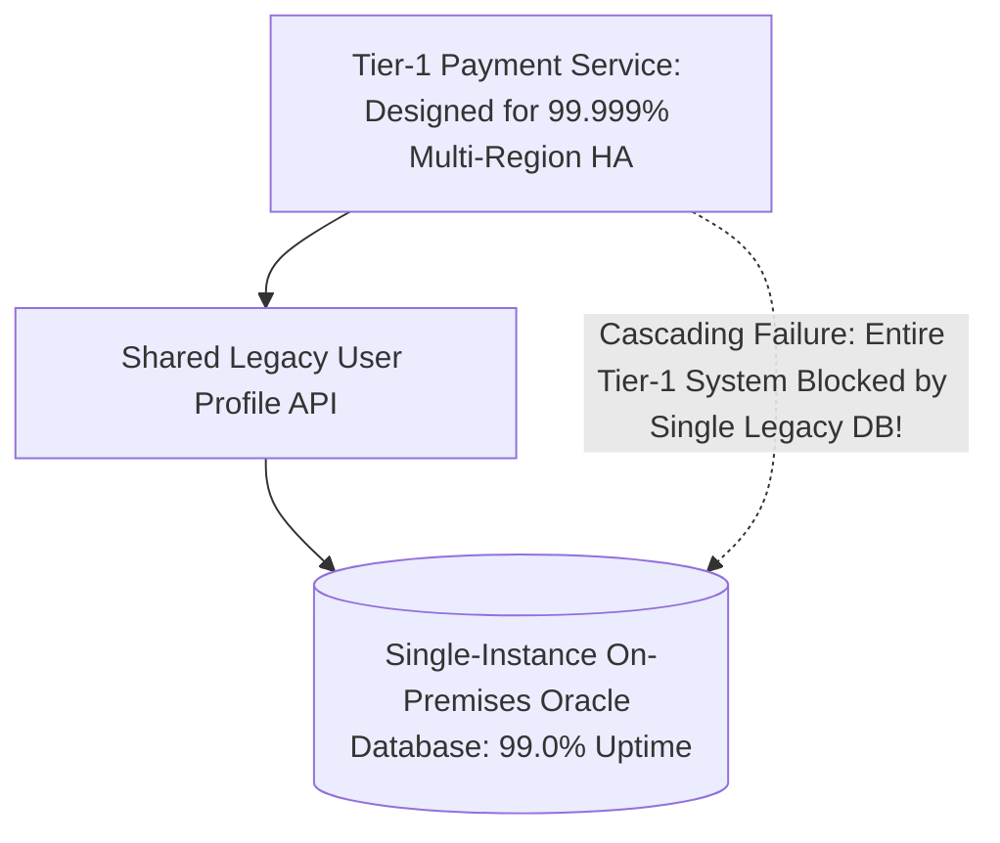

# Critical Path Dependency Mapping

## Executive Summary

A system is only as resilient as its weakest transitive dependency. Critical Path Dependency Mapping exposes hidden single points of failure (SPOFs) across the enterprise architecture.

---

## 1. The Hidden Shared Dependency Trap

---

## 2. Architectural Remediation: Graceful Degradation
- If the User Profile API is unreachable, the Payment Service must fall back to a cached local user profile or process the payment with basic fraud rules, queuing the profile synchronization asynchronously rather than failing the transaction.
