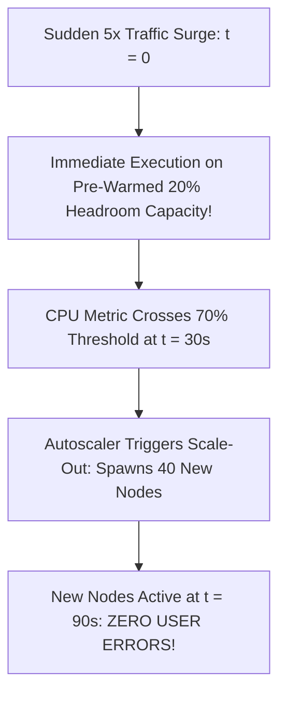

# Autoscaling Policies & Headroom Engineering

## Executive Summary

Autoscaling based purely on reactive CPU metrics often fails during sharp traffic surges due to VM spin-up latency.

---

## 1. Predictive Autoscaling & Headroom Buffers

---

## 2. Autoscaling Best Practices
1. **Target Tracking on Business Metrics**: Prefer autoscaling on queue backlog per instance (`ApproximateNumberOfMessages / FleetSize`) or requests per target rather than volatile raw CPU percentages.
2. **Step Scaling for Rapid Spikes**: Configure aggressive step scaling (+100% capacity if metric breaches high threshold) combined with conservative scale-in cooldown periods (300 seconds) to prevent thrashing.
