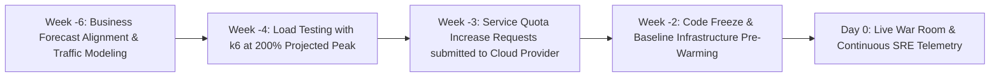

# Peak Traffic & Seasonal Surge Forecasting

## Executive Summary

Handling extreme demand events (e.g., Black Friday, Cyber Monday, open enrollment) requires coordinated architectural preparation weeks in advance.

---

## 1. The 6-Week Peak Preparation Runbook

---

## 2. Pre-Warming Cloud Infrastructure
- Hyperscale load balancers (AWS ALB) take minutes to scale horizontally during sudden traffic leaps. For scheduled surges, submit an **ALB Pre-Warming Request** to cloud support 48 hours in advance to pre-provision edge capacity.
