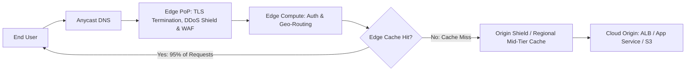

# CDN & Edge Architecture: Global Caching & Edge Compute

## Executive Summary

Content Delivery Networks (CDNs) and Edge computing platforms project application performance, security inspection, and computational logic to hundreds of globally distributed Points of Presence (PoPs) within milliseconds of end users.

---

## Edge Delivery Pipeline

---

## Deliverables & Guides

| Document | Focus Area | Architectural Impact |
| :--- | :--- | :--- |
| **[CDN Architecture](cdn-architecture.md)** | Core caching mechanics | Points of Presence, origin fetch, Cache-Control headers |
| **[Static vs Dynamic Caching](static-vs-dynamic-caching.md)** | Workload caching rules | Static media vs dynamic API response caching, bypass rules |
| **[Cache Invalidation & TTL](cache-invalidation-and-ttl.md)** | Cache coherency | Purge patterns, surrogate keys / cache tags, stale-while-revalidate |
| **[Edge Compute](edge-compute.md)** | Programmable edge | CloudFront Functions, Lambda@Edge, Cloudflare Workers |
| **[DDoS & WAF Integration](ddos-and-waf-integration.md)** | Edge security perimeter | Layer 7 rate limiting, bot protection, SYN-flood mitigation |
| **[Origin Shielding](origin-shielding.md)** | Backend protection | Mid-tier caching, protecting origins from cache stampedes |
