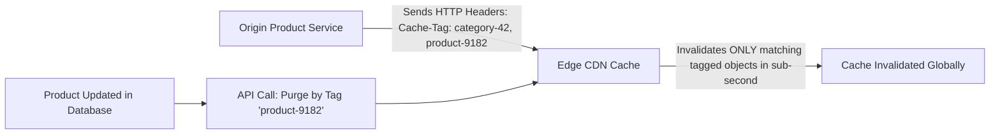

# Cache Invalidation, Purging & Surrogate Keys

## Executive Summary

> "There are only two hard things in Computer Science: cache invalidation and naming things." — Phil Karlton

Enterprise systems require precise, real-time cache invalidation mechanisms to update content immediately without triggering origin cache stampedes.

---

## 1. Invalidation Strategies: Surrogate Keys / Cache Tags

---

## 2. Invalidation Patterns Comparison

- **URL-Based Invalidation (`/images/logo.png`)**: Slow and coarse. Incur charges on large volume invalidations in AWS CloudFront.
- **Cache Tags / Surrogate Keys (Fastly, Cloudflare, Akamai)**: Group thousands of related URLs under metadata tags. When a single product changes, invalidating one tag purges the product page, recommendation widgets, and search listings globally in under $150\text{ milliseconds}$.
- **Soft Purging**: Marks cached objects as stale rather than purging them immediately. The stale object is served to clients while the CDN fetches the update from the origin in the background.
