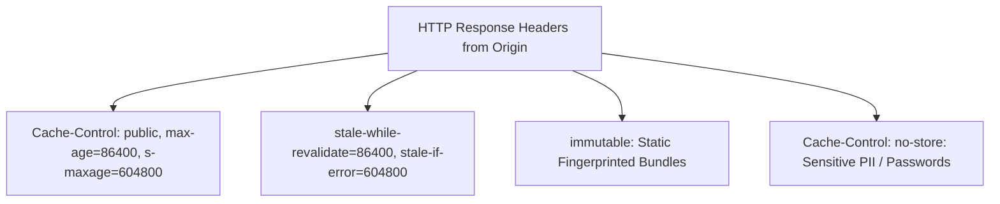

# CDN Architecture: PoPs, Origin Fetch & Cache-Control

## Executive Summary

A Content Delivery Network terminates client TCP and TLS handshakes at geographically proximate edge locations, serving cached content locally and multiplexing backhaul connections to cloud origins over optimized private backbones.

---

## 1. The HTTP Cache-Control Header Hierarchy

### Critical Directives
- **`s-maxage`**: Overrides `max-age` specifically for shared public caches (CDNs), allowing edge servers to cache content longer than client browsers.
- **`stale-while-revalidate`**: Instructs the edge cache to serve an existing stale object immediately while asynchronously issuing an origin fetch in the background, eliminating user-perceived cache miss latency.
- **`immutable`**: Informs caches that static assets with content hashes (`app.a8f9c1.js`) will never change, completely bypassing HTTP `If-Modified-Since` round-trips.
