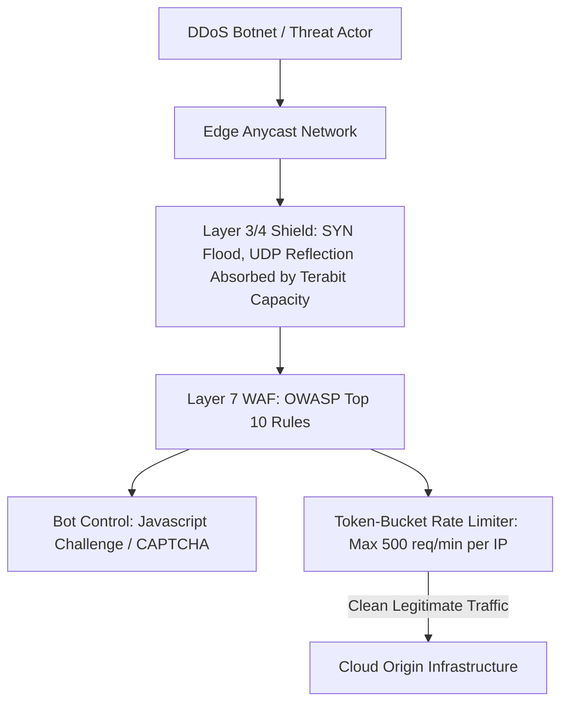

# Edge Security: DDoS Mitigation & WAF Integration

## Executive Summary

Projecting security inspection to the edge shields origin infrastructure from volumetric DDoS attacks, automated malicious bot scrapers, and Layer 7 exploits.

---

## 1. Multi-Layer Edge Security Architecture

---

## 2. Non-Negotiable WAF Baselines

1. **OWASP Core Rule Set (CRS)**: Enforce rules blocking SQL Injection (SQLi), Cross-Site Scripting (XSS), Local File Inclusion (LFI), and command injection.
2. **Rate-Based IP Limiting**: Automatically throttle or block IP addresses exceeding 500 requests per 5-minute rolling window on login and checkout endpoints.
3. **Geo-Blocking**: Block traffic originating from geographic territories outside the organization's business operating license at the edge to reduce attack surface.
