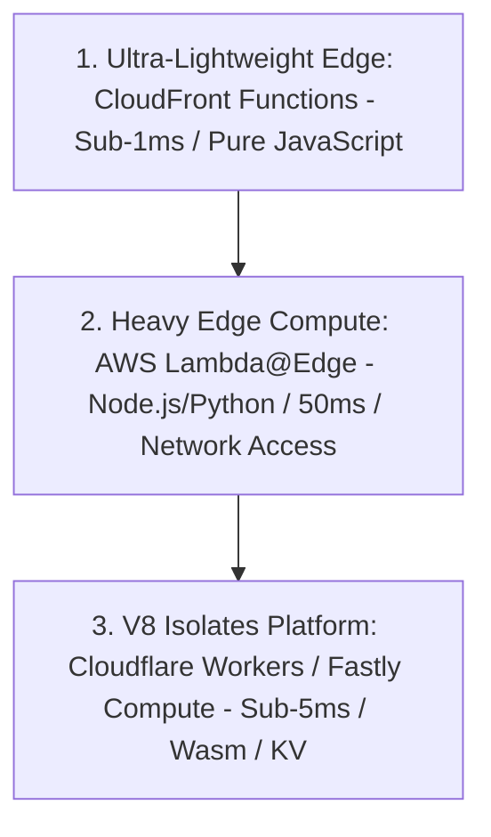

# Edge Compute: CloudFront Functions vs Lambda@Edge vs Cloudflare Workers

## Executive Summary

Edge compute allows running lightweight business logic directly inside edge PoPs worldwide. Selecting an edge compute tier requires balancing **execution latency**, **compute capabilities**, and **runtime limitations**.

---

## 1. Edge Compute Hierarchy

---

## 2. Comparative Matrix & Rules of Engagement

| Dimension | CloudFront Functions | AWS Lambda@Edge | Cloudflare Workers |
| :--- | :--- | :--- | :--- |
| **Execution Location** | 450+ Edge PoPs (Viewer Facing) | 13 Regional Edge Caches | 300+ Edge PoPs (Worldwide) |
| **Startup Time** | **Sub-millisecond (Zero cold starts)**| $50 - 250\text{ ms}$ (Cold start) | **Sub-millisecond (V8 Isolates)** |
| **Max Execution Duration**| $10\text{ milliseconds}$ | 5 to 30 seconds | 50 milliseconds to 30 seconds |
| **Network & File Access** | **None** (No external HTTP or DB) | Full network access (Can call DB/APIs) | Full network access + Edge KV/D1 |
| **Architectural Scope** | HTTP header rewrites, URL redirects, JWT validation | Dynamic HTML rendering, complex auth | Full edge microservices, edge GraphQL |
