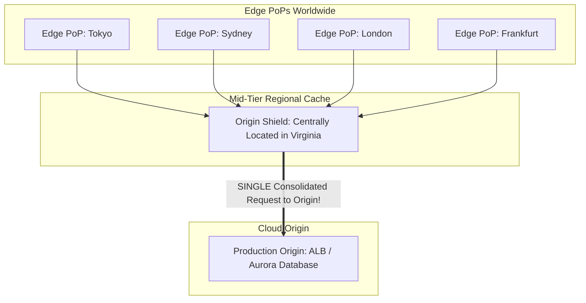

# Origin Shielding & Protecting Backends from Cache Stampedes

## Executive Summary

When a popular cached object expires across 450 edge locations simultaneously, hundreds of edge PoPs issue simultaneous backend origin fetches. This **Cache Stampede (Thundering Herd)** can overwhelm origin load balancers and crash databases.

---

## 1. Origin Shield Architecture

---

## 2. Collapse Forwarding / Request Coalescing

- **Collapse Forwarding**: When 100 concurrent requests for the identical uncached URL hit an Origin Shield simultaneously, the shield holds 99 requests in memory and sends **exactly one request** to the origin server.
- Once the origin responds, the single response satisfies all 100 waiting client requests, reducing origin traffic spikes by 99%.
