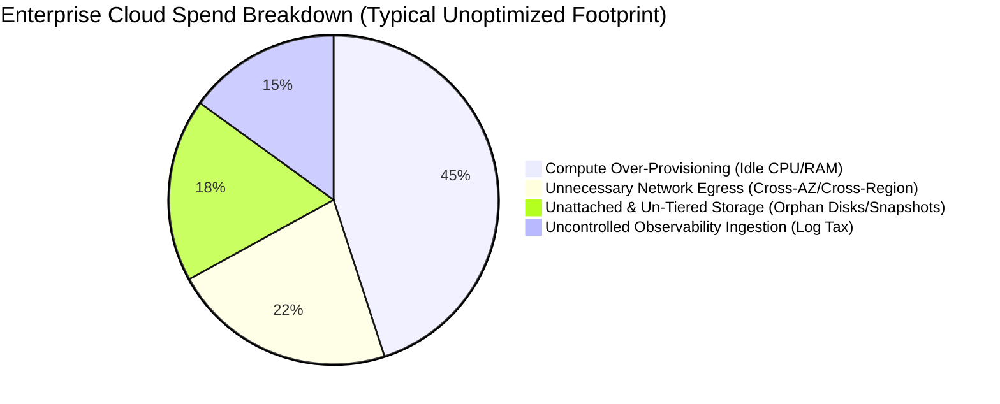
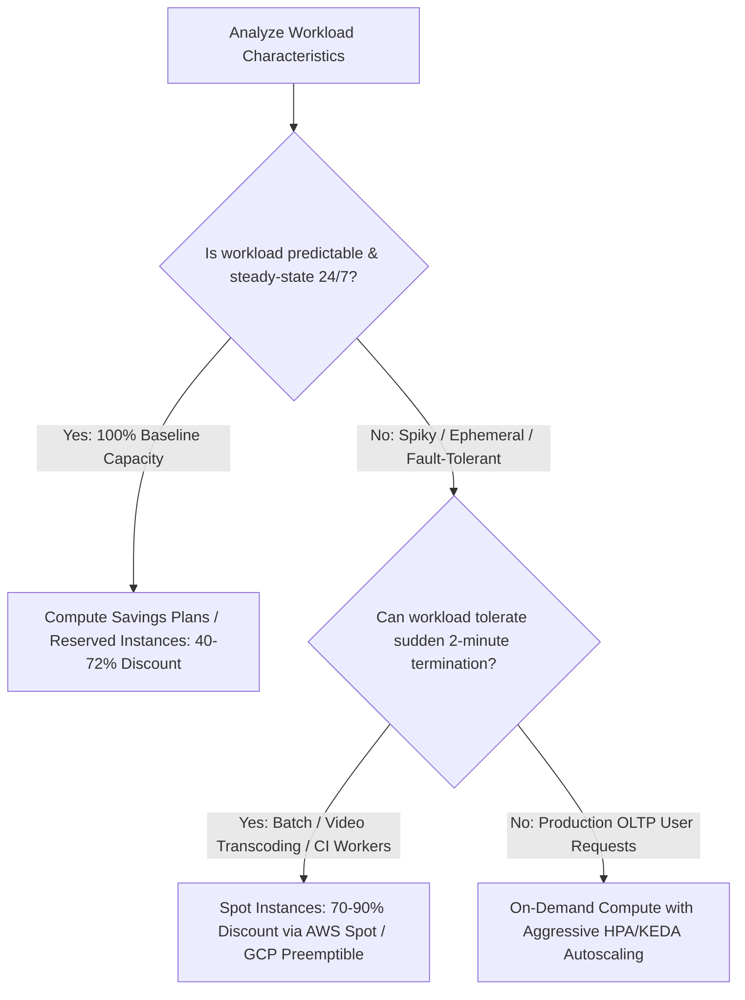

# Cloud FinOps & Cost Optimization Architecture: Rightsizing, Egress, and Unit Economics

## 1. Architectural Overview & Context
**Cloud FinOps (Financial Operations)** is the architectural discipline of combining systems architecture, engineering practices, and financial accountability to maximize the business value delivered per cloud dollar spent.

In cloud environments, resource provisioning is decentralized: every engineer with Terraform access is essentially making purchasing decisions:
> **The FinOps Law of Architecture**:
> *Cloud cost is an architectural Non-Functional Requirement (NFR). A system that scales to 1,000,000 users but costs $50 per transaction to operate is an architectural failure.*

```
┌─────────────────────────────────────────────────────────────────────────────┐
│                       THE 3 PHASES OF CLOUD FINOPS                          │
├─────────────────────┬───────────────────────────────────────────────────────┤
│ 1. Inform           │ Real-time visibility into costs, automated resource   │
│                     │ tagging, and unit economic attribution per team/tenant│
├─────────────────────┼───────────────────────────────────────────────────────┤
│ 2. Optimize         │ Architectural rightsizing, commitment purchases,      │
│                     │ egress minimization, and storage lifecycle automation │
├─────────────────────┼───────────────────────────────────────────────────────┤
│ 3. Operate          │ Continuous automated governance: budget alerting,     │
│                     │ idle resource termination, and architecture reviews   │
└─────────────────────┴───────────────────────────────────────────────────────┘
```

---

## 2. The Cloud Cost Hierarchy & Top 4 Waste Drivers



---

## 3. Compute Optimization: Rightsizing, Commitments, and Spot



### Serverless vs. Kubernetes Unit Economics:
* **Serverless Functions (AWS Lambda)**: Cost is strictly per execution duration. Highly cost-effective for spiky, low-traffic APIs ($< 5\text{M}$ requests/month).
* **Kubernetes (EKS / GKE)**: High fixed control plane and worker node cost. Becomes drastically cheaper than Serverless once sustained throughput exceeds $500 - 1000$ RPS.

---

## 4. Network Egress: Eliminating the Silent Cloud Tax

Cloud providers offer free inbound data transfer, but impose heavy **Network Egress Fees**:
* **Public Internet Egress**: $\approx \$0.08 - \$0.09$ per GB!
* **Cross-AZ Traffic (within same region)**: $\approx \$0.01 - \$0.02$ per GB (traversing availability zones).
* **Cross-Region Traffic**: $\approx \$0.02 - \$0.04$ per GB.

```
❌ Costly Unoptimized Network Egress:
[Service A in AZ-1] ──(Queries via Public S3 URL)──► [NAT Gateway ($0.045/GB)] ──► [Internet] ──► [S3 ($0.09/GB)]
Result: Paying twice for internal cloud communication!

✅ FinOps Optimized Network Architecture:
[Service A in AZ-1] ──(Queries via S3 Gateway VPC Endpoint)───────────────────────► [S3]
Result: $0.00 / GB! Gateway endpoints are 100% FREE and never leave the AWS internal backbone.
```

---

## 5. Observability Cost Governance (The "Log Ingestion Tax")

Datadog, Splunk, and cloud-native logging services frequently become the 2nd or 3rd largest bill in an engineering organization due to unbounded log volume:
* **Anti-Pattern**: Applications logging multi-kilobyte JSON request/response payloads at `INFO` level for 10,000 RPS endpoints.
* **Architectural Mitigation**:
  1. **Dynamic Log Sampling**: Log only 1% of successful `HTTP 200` requests, but 100% of errors (`HTTP 4xx/5xx`).
  2. **Metrics Cardinality Caps**: Never include unbounded strings (user IDs, credit card numbers, email addresses) as Prometheus metric label dimensions!

---

## 6. Cloud FinOps Architectural Checklist
- [ ] Enforce automated tagging policies (`CostCenter`, `Environment`, `ServiceOwner`, `Project`) across all cloud resources.
- [ ] Implement AWS Gateway VPC Endpoints for S3 and DynamoDB to eliminate NAT gateway egress charges.
- [ ] Purchase 1-year or 3-year Compute Savings Plans for baseline 24/7 compute workloads.
- [ ] Adopt Spot instances for asynchronous background queues, batch jobs, and CI/CD worker pools.
- [ ] Configure S3 Lifecycle policies (transition to Glacier Instant Retrieval after 90 days; delete temp logs after 14 days).
- [ ] Establish Unit Cost Metrics (e.g. *Cost Per Order Placed*, *Cost Per Active User*) to measure architectural efficiency over gross spend.

---

## 7. Related Modules
* [01-architecture/cloud-architecture/](../../01-architecture/cloud-architecture/README.md) — Cloud topology, multi-region failover, and landing zones.
* [08-cloud/cloud-native/](../cloud-native/README.md) — Twelve-factor microservices, autoscaling, and container orchestration.
* [11-observability/](../../11-observability/) — Log management, metrics retention, and distributed tracing costs.
