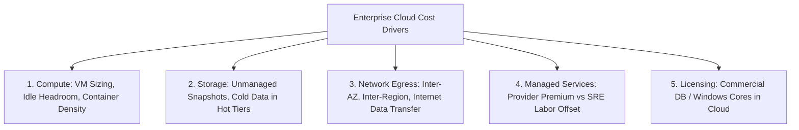

# Cloud Cost Architecture & Economic Engineering

## Executive Summary

Architecture decisions are economic decisions. A technically elegant architecture that bankrupts the business is an architectural failure. Cloud cost must be modeled, budgeted, and tracked as a primary architectural constraint alongside latency and throughput.

---

## The Cloud Cost Stack

---

## Deliverables & Guides

| Document | Focus Area | Architectural Impact |
| :--- | :--- | :--- |
| **[Cost Drivers Architecture](cost-drivers-architecture.md)**| Primary cost drivers | Compute, storage, egress, managed service markups, licensing |
| **[Egress Cost Engineering](egress-cost-engineering.md)** | Network spend reduction | Cross-AZ traps, cross-region replication, PrivateLink vs NAT |
| **[Commitment Discounts](commitment-discounts.md)** | Financial instruments | Compute Savings Plans, Reserved Instances, Spot/Preemptible |
| **[Right-Sizing & Idle Detection](right-sizing-and-idle-detection.md)**| Capacity waste reduction | Automated right-sizing, terminating zombie volumes & snapshots |
| **[Cloud Cost Estimation Framework](cloud-cost-estimation-framework.md)**| Upfront modeling | Architecture-driven cost estimation before code deployment |
