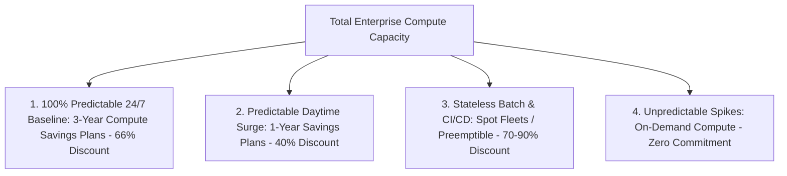

# Commitment Discounts: Savings Plans, Reserved Instances & Spot

## Executive Summary

Enterprises should never pay On-Demand rates for predictable baseline infrastructure. Combining financial discount instruments reduces compute spend by up to 70%.

---

## 1. Compute Purchasing Portfolio Strategy

---

## 2. Savings Plans vs Reserved Instances (RIs)
- **Legacy Reserved Instances**: Bound to specific instance types and regions (`m5.large` in `us-east-1`). If the enterprise modernizes to Graviton (`m7g`), the RI is orphaned.
- **Compute Savings Plans**: Commit to an hourly dollar spend ($/hour) across 1 or 3 years. Automatically applies across any instance family, any region, Fargate serverless containers, and Lambda, providing maximum architectural agility.
