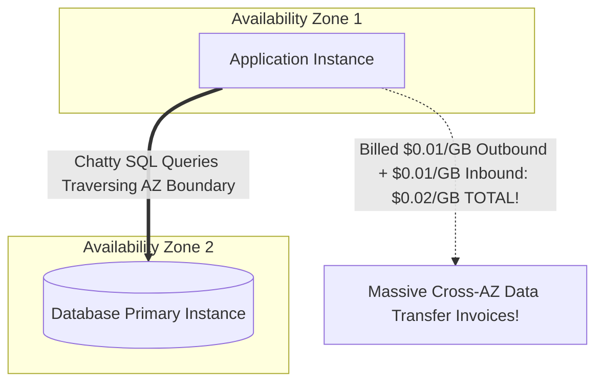

# Network Egress Cost Engineering

## Executive Summary

Network transfer charges are the most frequently overlooked cost driver in enterprise cloud architectures.

---

## 1. The Cross-AZ Data Transfer Trap

---

## 2. Egress Optimization Architectural Rules

1. **Keep High-Volume Traffic Intra-AZ**:
   - For high-throughput analytics or batch pipelines, co-locate compute and data within the identical Availability Zone.
2. **Use VPC Gateway Endpoints for S3 & DynamoDB**:
   - Accessing S3 via NAT Gateways incurs $\$0.045/\text{GB}$ in NAT data processing fees. Enabling free VPC Gateway Endpoints eliminates this cost completely.
3. **Compress Payloads Before WAN Transmission**:
   - Compressing JSON payloads into binary formats (Avro, Protobuf, Parquet) with zstandard compression reduces network transfer volumes by 70–80%.
