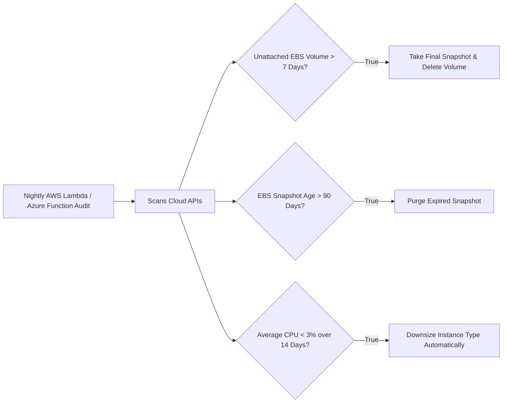

# Right-Sizing Architecture & Idle Resource Detection

## Executive Summary

Enterprise cloud environments are filled with "zombie infrastructure"—unattached disks, idle load balancers, and severely over-provisioned virtual machines.

---

## 1. Automated Garbage Collection Pipeline

---

## 2. Right-Sizing Sizing Guardrails
- **Target Utilization**: Size production compute instances to operate at **60–70% average CPU and memory utilization**. An instance running at 10% CPU is 4x over-provisioned.
- **Modernize Instance Generations**: Upgrading from generation 5 (e.g., `m5`) to generation 7 (e.g., `m7g`) provides a 20% performance increase at a 15% lower nominal hourly rate.
