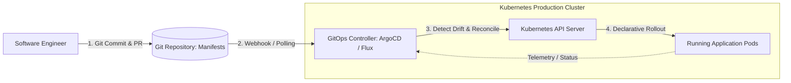
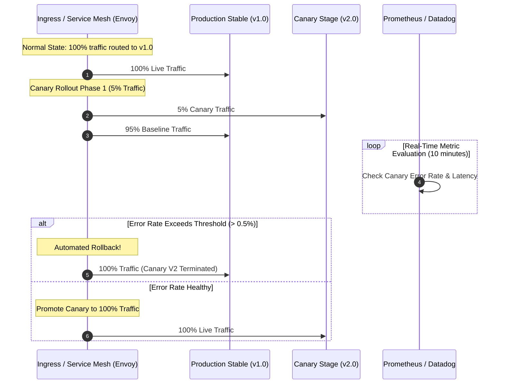

# Cloud-Native Architecture: Twelve-Factor Evolution, GitOps, and Progressive Delivery

## 1. Architectural Overview & Philosophy
The term **Cloud-Native** describes an approach to building and running applications that fully exploits the advantages of the cloud computing delivery model: elasticity, managed services, automated self-healing, and continuous deployment.

A foundational architectural myth must be dispelled:
> **Cloud-Native does NOT automatically mean Kubernetes + Microservices.**
> *A modular monolith running on AWS ECS Fargate or Google Cloud Run, utilizing managed RDS and S3, with automated CI/CD and OpenTelemetry, is 100% cloud-native—often with 1/10th the cognitive and operational overhead of an over-engineered Kubernetes cluster.*

```
┌─────────────────────────────────────────────────────────────────────────────┐
│                       THE 4 PILLARS OF CLOUD-NATIVE                         │
├─────────────────────┬───────────────────────────────────────────────────────┤
│ 1. Immutable Infra  │ Servers and containers are never patched in-place;    │
│                     │ deployments replace instances completely (Cattle).    │
├─────────────────────┼───────────────────────────────────────────────────────┤
│ 2. Declarative State│ System state declared in Git (GitOps); automated      │
│                     │ control loops continuously reconcile actual state.    │
├─────────────────────┼───────────────────────────────────────────────────────┤
│ 3. Micro-Services / │ Loosely coupled services organized around business    │
│    Bounded Contexts │ domain capabilities with explicit API contracts.      │
├─────────────────────┼───────────────────────────────────────────────────────┤
│ 4. Observability    │ Deep telemetry (Traces, Metrics, Logs) baked directly │
│                     │ into runtimes from Day 1 via OpenTelemetry standards. │
└─────────────────────┴───────────────────────────────────────────────────────┘
```

---

## 2. Evolution of the Twelve-Factor App (The 15 Modern Factors)

The classic Heroku Twelve-Factor methodology has evolved to address modern cloud-native realities:

| Classic 12-Factor | Modern Cloud-Native Addition | Architectural Requirement |
|---|---|---|
| **I. Codebase** | Monorepo or Multi-repo | Single source of truth tracked in Git with automated CI verification. |
| **III. Config** | Secret Stores & External Config | Secrets injected at runtime from HashiCorp Vault / Cloud KMS; never baked into image. |
| **VI. Processes** | Ephemeral & Stateless | Nodes can be terminated abruptly by cloud autoscalers with zero data loss. |
| **VIII. Concurrency** | Horizontal Scaling via KEDA | Scale out processes based on queue depth, HTTP requests, or CPU utilization. |
| **IX. Disposability** | Fast Startup & Graceful Shutdown | Listen for `SIGTERM`, drain active HTTP connections within 30s, and exit cleanly. |
| **New: Telemetry** | Observability-First | Application exports W3C traceparent headers and Prometheus metrics natively. |
| **New: API First** | Contract-Driven Development | OpenAPI / Protobuf schemas published and validated before writing implementation code. |
| **New: Security** | Zero Trust & Least Privilege | No ambient network trust; workloads execute with minimal IAM roles and mTLS. |

---

## 3. Declarative Control Loops & GitOps Architecture

In cloud-native systems, human engineers never run `kubectl apply` or modify production servers directly. All mutations occur via **GitOps**:



### The Declarative Reconciliation Loop:
$$\text{Observed State} \neq \text{Desired State in Git} \implies \text{Controller executes remediation!}$$
If a developer manually tampers with a pod in production, ArgoCD immediately detects the drift and overwrites the cluster back to the version declared in Git.

---

## 4. Progressive Delivery & Deployment Strategies Compared

```
Rolling Deployment (In-Place Transition)           Blue/Green Deployment (Instant Cutover)
┌───────────────────────────────────────┐         ┌───────────────────────────────────────┐
│ Pod v1  Pod v1  Pod v2  Pod v2        │         │ Green Pool (v2 - 100% Traffic) ◄──Router
│ - Staggered replacement               │         │ Blue Pool (v1 - Idle Standby)         │
│ - Mixed versions run concurrently!    │         │ - Instant rollback; requires 2x compute│
└───────────────────────────────────────┘         └───────────────────────────────────────┘
```



---

## 5. Cloud-Native Architectural Checklist
- [ ] Implement graceful shutdown hooks (`SIGTERM`) to drain active requests within 30 seconds.
- [ ] Eliminate local filesystem persistence; store all state in external databases or object storage.
- [ ] Adopt GitOps (ArgoCD / Flux) as the exclusive deployment mechanism for production infrastructure.
- [ ] Enforce automated progressive rollouts (Canary deployments via Argo Rollouts or Flagger).
- [ ] Inject secrets dynamically at runtime from AWS Secrets Manager / Vault (never in container images).
- [ ] Integrate OpenTelemetry auto-instrumentation for distributed tracing across all container pods.

---

## 6. Related Modules
* [08-cloud/cloud-cost-optimization/](../cloud-cost-optimization/README.md) — FinOps cost governance and rightsizing.
* [01-architecture/cloud-architecture/](../../01-architecture/cloud-architecture/README.md) — Cloud topology, multi-region failover, and landing zones.
* [09-devops/](../../09-devops/) — CI/CD pipelines, container build security, and infrastructure as code.
