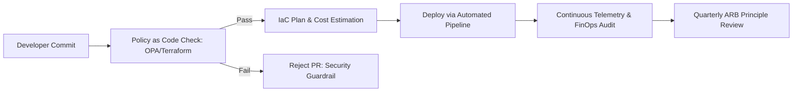

# Enterprise Cloud Architecture Principles

```yaml
status: approved
decision_type: architecture-principles
scope: enterprise-cloud
owners: architecture-review-board
review_cadence: annual
```

## Executive Summary

These twenty principles define the foundational architectural philosophy governing all cloud and infrastructure decisions across the enterprise. They enforce discipline, prevent technology hype, ensure financial accountability, and protect the organization from catastrophic failure modes.

---

## The 20 Enterprise Cloud Principles

### 1. Cloud Follows Business Requirements
Cloud computing is a means to achieve business agility, reliability, scalability, and geographic reach—never an end in itself. Every cloud initiative must map directly to measurable business KPIs, compliance mandates, or total cost of ownership (TCO) objectives.

### 2. Prefer Managed Services When Operational Economics Justify Them
Delegate commoditized operational toil (hardware maintenance, OS patching, disk replacement, automated backup schedules) to cloud provider managed services (e.g., AWS RDS, Azure Cosmos DB, GCP Cloud SQL) whenever the savings in engineering head-hours exceed the premium charged by the cloud provider.

### 3. Minimize Unnecessary Operational Complexity
Every additional layer of abstraction (custom Kubernetes operators, multi-cloud abstraction layers, bespoke mesh networks) imposes an operational tax. Architecture must be as simple as possible to meet the NFRs, but no simpler. Choose managed containers or serverless before self-hosting complex distributed platforms.

### 4. Design Explicitly for Failure
Assume that every component—virtual machines, disks, availability zones, network switches, and provider control planes—will eventually fail. Design systems with automated health checking, graceful degradation, circuit breakers, and automated self-healing without manual human intervention.

### 5. Treat Identity as the Primary Security Boundary
In modern cloud environments, network firewalls are secondary perimeter defenses. IAM (users, roles, service accounts, and workload identities) is the true perimeter. Enforce strict Zero Trust, attribute-based access control (ABAC), ephemeral credentials, and mutual TLS (mTLS) across all service communications.

### 6. Automate 100% of Infrastructure as Code (IaC)
No resource shall ever be created, modified, or deleted through the cloud management console in production or staging environments. All infrastructure must be defined declaratively in version-controlled repositories (e.g., Terraform, OpenTofu), validated via automated linting and security scanning, and deployed exclusively via audited CI/CD pipelines.

### 7. Infrastructure Must Be Fully Reproducible
An entire environment—including networking, security policies, data stores, and compute clusters—must be fully reproducible from version control in an alternate cloud account or region within predefined recovery time objectives (RTO).

### 8. Make Environments Chemically Consistent
Development, staging, and production environments must maintain architectural parity. Avoid running local SQLite or single-container databases in development while running distributed Aurora or CockroachDB in production. Use containerized local emulators and automated test fixtures to mirror production failure modes early.

### 9. Make Cost Visible from Day Zero (FinOps by Design)
Cost is a first-class architectural attribute alongside latency and throughput. Cloud architectures must incorporate cost modeling before deployment. Enforce strict mandatory resource tagging, real-time cost alerting, and architectural tracking of unit economics (e.g., infrastructure cost per processed transaction).

### 10. Design for Deep Observability
Systems must be designed from inception to emit structured, correlated telemetry: distributed traces, multidimensional metrics, and JSON logs with unified correlation IDs. Infrastructure health must be measured through user-centric Service Level Indicators (SLIs) and Service Level Objectives (SLOs), not raw CPU percentages.

### 11. Minimize Blast Radius Through Strict Segmentation
Failure in one subsystem must never cascade to others. Enforce blast radius boundaries using multi-account/multi-subscription landing zones, isolated VPCs/VNets, private subnets, Kubernetes namespaces, and bulkhead architectural patterns.

### 12. Separate Critical and Regulated Workloads
Workloads subject to stringent compliance standards (PCI-DSS, HIPAA, FedRAMP, GDPR) must be physically or logically isolated into dedicated cloud accounts and networks with dedicated encryption keys and restrictive egress controls to prevent compliance audit creep.

### 13. Avoid Unnecessary Vendor Lock-In
Maintain architectural portability at the data and application layers by relying on open standards (SQL, OCI container images, OpenTelemetry, Kafka, gRPC). Do not write business logic that directly couples domain code to cloud-proprietary SDKs without an anti-corruption layer.

### 14. Accept Intentional Vendor Lock-In When Business Value Justifies It
Do not compromise system performance, time-to-market, or operational simplicity to achieve theoretical multi-cloud portability. If a proprietary managed service (e.g., AWS DynamoDB, GCP BigQuery, Azure Cosmos DB) delivers a 10x business advantage and eliminates millions in operational overhead, accept the vendor lock-in intentionally and document the exit strategy.

### 15. Test Disaster Recovery Continuously in Production-Like Conditions
A disaster recovery plan that has not been executed under realistic failure scenarios is an unverified hypothesis. Conduct regular, automated chaos engineering exercises, regional failover drills, and backup restoration verification.

### 16. Automate Security Guardrails (Policy as Code)
Enforce security baselines automatically at the pull request and deployment levels using Policy as Code (e.g., OPA Gatekeeper, Kyverno, AWS SCPs, Azure Policy). Prevent dangerous misconfigurations (e.g., public S3 buckets, unencrypted volumes, 0.0.0.0/0 ingress) before they can be provisioned.

### 17. Prefer Evolutionary Architecture Over Big-Bang Redesigns
Design infrastructure to accommodate incremental change. Use the Strangler Fig pattern, canary traffic shifting, feature flags, and modular landing zones so that infrastructure components can be swapped or upgraded with zero system downtime.

### 18. Avoid Premature Multi-Region Architecture
Multi-region active-active architectures introduce profound distributed state challenges, data replication lag, split-brain risks, and massive egress costs. Exhaust single-region multi-AZ resiliency before adopting multi-region active-active topologies. Adopt multi-region only when regulatory data sovereignty or strict sub-second RTO mandates it.

### 19. Avoid Premature Kubernetes Adoption
Kubernetes is a powerful distributed orchestration platform, but it carries immense operational cognitive load, cluster lifecycle maintenance, and security hardening overhead. Evaluate serverless containers (AWS Fargate, Cloud Run, Azure Container Apps) or managed PaaS before introducing Kubernetes clusters.

### 20. Infrastructure Architecture Must Evolve With Workload Maturity
Infrastructure is not static. A startup prototype requires rapid serverless iteration; a scaling enterprise service requires tuned container clusters; a hyper-scale mature platform may require reserved instances, custom networking, or selective colocation. Continuously re-evaluate infrastructure against the workload lifecycle.

---

## Principle Enforcement Matrix



| Enforcement Mechanism | Responsible Role | Principle Coverage |
| :--- | :--- | :--- |
| **Policy as Code (CI/CD)** | Platform / SecOps | Principles 5, 6, 11, 12, 16 |
| **Architecture Review Board (ARB)** | Enterprise Architects | Principles 1, 2, 3, 13, 14, 18, 19 |
| **Automated Chaos Drills** | SRE / DevOps | Principles 4, 7, 8, 15 |
| **FinOps Anomaly Detection** | Cloud FinOps Team | Principles 9, 20 |
| **Distributed Telemetry Standards** | App Engineering Leads | Principles 10, 17 |
