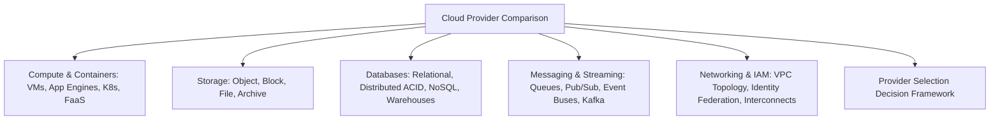

# Cloud Provider Comparison: AWS vs Azure vs GCP

## Executive Summary

Selecting a primary cloud provider—or deciding where to place specific enterprise workloads—must never be based on marketing claims or developer popularity. This section provides an **objective, architectural comparison** across the three dominant hyper-scalers (Amazon Web Services, Microsoft Azure, Google Cloud Platform) mapped against enterprise NFRs, governance models, and cost structures.

---

## Architectural Comparison Domains

---

## Deliverables & Comparative Guides

| Comparison Area | Document | Core Focus & Comparative Analysis |
| :--- | :--- | :--- |
| **Compute & Containers** | **[Compute Comparison](compute-comparison.md)** | EC2 vs Azure VM vs GCE; ECS vs App Service vs Cloud Run; EKS vs AKS vs GKE; Lambda vs Functions |
| **Storage Infrastructure**| **[Storage Comparison](storage-comparison.md)** | S3 vs Blob vs GCS; EBS vs Managed Disks vs Persistent Disks; EFS vs Azure Files |
| **Database Platforms** | **[Database Comparison](database-comparison.md)** | Aurora vs Azure SQL Hyperscale vs Cloud SQL; DynamoDB vs Cosmos DB vs Spanner |
| **Messaging & Events** | **[Messaging & Streaming Comparison](messaging-streaming-comparison.md)**| SQS/SNS vs Service Bus/Event Grid vs Pub/Sub; MSK vs Event Hubs |
| **Networking & Identity** | **[Networking & IAM Comparison](networking-iam-comparison.md)** | Regional vs Global VPCs; AWS IAM vs Microsoft Entra ID vs GCP IAM |
| **Selection Framework** | **[Provider Selection Framework](cloud-provider-selection-framework.md)** | Measurable 10-factor decision scorecard for enterprise provider selection |
