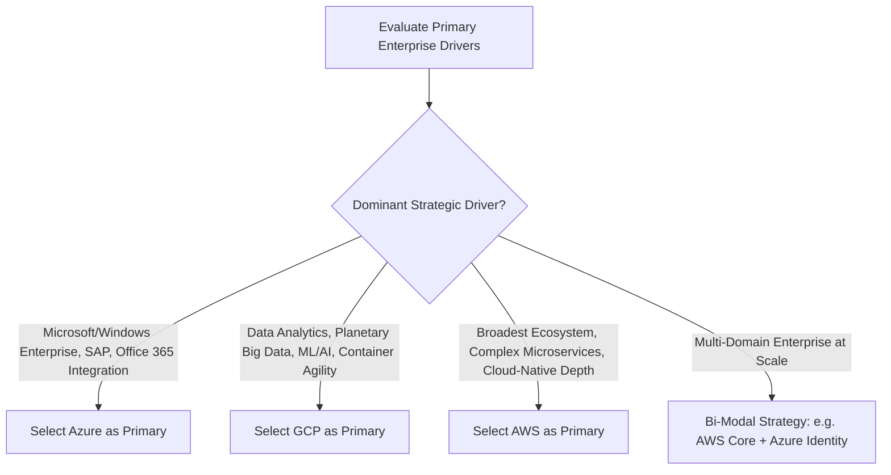

# Cloud Provider Selection Framework

```yaml
status: approved
decision_type: framework
scope: enterprise-cloud-selection
owners: enterprise-architecture-board
review_cadence: annual
```

## Executive Summary

This framework provides an objective, empirical methodology for evaluating and selecting cloud service providers. It establishes that **no single cloud provider is universally superior**; rather, provider selection must be derived from organizational competencies, existing enterprise software licenses, architectural workload profiles, and regulatory constraints.

---

## 1. Enterprise Provider Decision Matrix



---

## 2. Comparative Evaluation Scorecard

| Architectural Dimension | Choose Amazon Web Services (AWS) | Choose Microsoft Azure | Choose Google Cloud Platform (GCP) |
| :--- | :--- | :--- | :--- |
| **Enterprise Alignment** | Autonomous engineering culture; digital-native organizations; deep open-source microservices. | Heavy existing Microsoft footprint; Enterprise Agreement (EA) discounts; SAP on Azure partnerships. | Data science-led organizations; high-throughput analytics; Kubernetes-centric platforms. |
| **Compute & Containers** | Unmatched breadth of instance families; market-leading Graviton price/performance; robust ECS/Fargate. | Native .NET Core optimization; strong Windows Server containers; hybrid Azure Stack. | **GKE Autopilot** (best managed K8s); **Cloud Run** (best serverless container concurrency). |
| **Data & Analytics** | Mature Aurora distributed databases; proven DynamoDB single-table scaling. | Azure SQL Hyperscale; deep integration with PowerBI and Microsoft Fabric. | **Google BigQuery** (industry gold standard); **Cloud Spanner** (true global ACID). |
| **Global Networking** | High control via Transit Gateway and AWS Global Accelerator. | Global Virtual WAN; extensive edge network for enterprise branch offices. | **Global VPC by default**; single Anycast IP routing; lowest global network latency. |
| **Identity & Governance** | Highly granular JSON policies; account-level blast radius isolation via Organizations. | **Microsoft Entra ID** (unmatched corporate directory integration); seamless PIM. | Clean hierarchical resource model (Org $\rightarrow$ Folder $\rightarrow$ Project). |
| **AI / Machine Learning** | Amazon SageMaker; custom Trainium/Inferentia chips. | Azure OpenAI Service (exclusive commercial GPT models); Azure AI Studio. | Vertex AI; industry-leading Tensor Processing Units (TPUs); Gemini enterprise models. |

---

## 3. Governance Ruling on Single vs Multi-Provider

1. **Avoid 50/50 Dual-Primary Commitments**:
   - Committing to two primary cloud providers simultaneously to run identical workloads doubles enterprise compliance costs, fragments engineering talent, and eliminates volume discounting tiers.
2. **Primary Provider with Strategic Specialization**:
   - Establish **one primary cloud provider** for 80% of enterprise workloads.
   - Authorize a **secondary specialized provider** only when justified by a 10x architectural capability (e.g., AWS primary for transactional SaaS + GCP BigQuery for central business intelligence).
