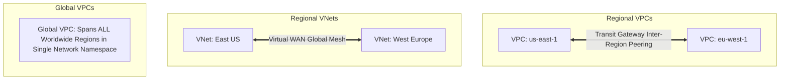

# Networking & IAM Architecture Comparison: AWS vs Azure vs GCP

## Executive Summary

Networking topology and identity federation represent the two most foundational architectural constraints in any enterprise cloud deployment.

---

## 1. Networking Architecture Comparison

| Dimension | AWS Networking | Azure Networking | GCP Networking |
| :--- | :--- | :--- | :--- |
| **VPC Scope** | **Regional**: A VPC exists only inside one AWS region. | **Regional**: A VNet exists only inside one Azure region. | **Global**: A single VPC spans all global regions simultaneously. |
| **Cross-Region Transit**| AWS Transit Gateway with Inter-Region Peering | Azure Virtual WAN with global routing hub | Native global routing over Google fiber backbone |
| **Private PaaS Access** | AWS PrivateLink (Interface Endpoints) | Azure Private Endpoints (Private Link) | Google Private Service Connect (PSC) |
| **Load Balancing** | Regional ALBs; Route 53 for global DNS failover | Regional ALBs; Azure Front Door for global Anycast | **Global External Load Balancer (Single Anycast IP worldwide)** |

---

## 2. Identity & Access Management (IAM) Comparison

| Dimension | AWS IAM | Microsoft Entra ID (Azure) | GCP Cloud IAM |
| :--- | :--- | :--- | :--- |
| **Philosophy** | Account-centric JSON policies (Allow/Deny) | Directory-centric RBAC & PIM | Resource-hierarchy role binding |
| **Enterprise Identity** | IAM Identity Center (Federates with external IDP) | **Native Enterprise IDP** (M365, Windows, Active Directory)| Google Cloud Identity (Federates with Entra/Okta) |
| **Workload Identity** | IAM Roles for EC2 / EKS Pod Identity | Azure Managed Identities & Workload Identity | GCP Workload Identity Federation |
| **Evaluation Model** | Explicit Deny > Explicit Allow > Default Deny | RBAC assignments with Deny Assignments | Inherited roles down Organization $\rightarrow$ Folder $\rightarrow$ Project |
