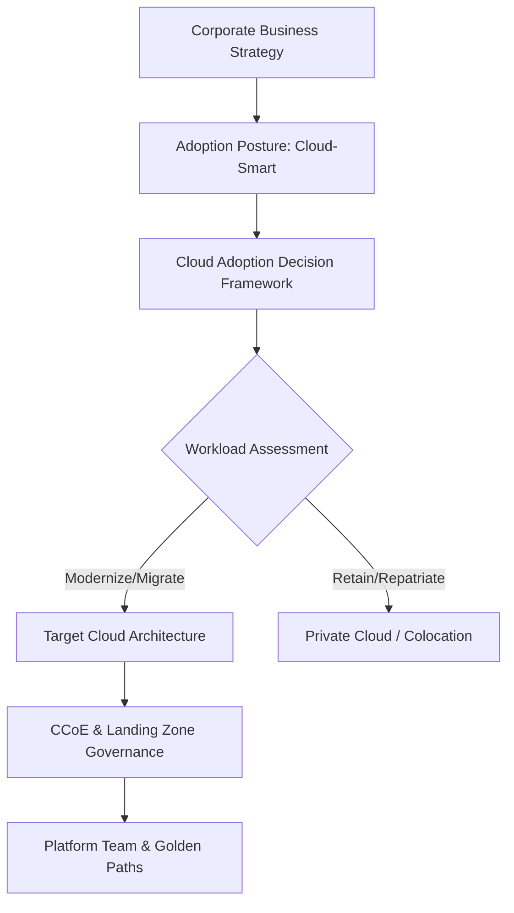

# Enterprise Cloud Strategy

## Executive Summary

A cloud strategy is not an IT project; it is a business transformation strategy that redefines how an enterprise delivers digital value, allocates capital, manages technology risk, and organizes engineering teams. 

A disciplined cloud strategy prevents two catastrophic failure modes:
1. **The "Lift-and-Shift Trap"**: Moving legacy monolithic architectures directly to cloud VMs without modernization, resulting in higher operational costs and zero agility gains.
2. **The "Resume-Driven Refactoring Trap"**: Rewriting stable, low-change systems into bleeding-edge distributed microservices without business justification.

---

## Strategic Capabilities & Guides

| Document | Focus Area | Architectural Impact |
| :--- | :--- | :--- |
| **[Cloud Adoption Strategy](cloud-adoption-strategy.md)** | Strategic adoption postures | Cloud-First vs Cloud-Smart vs Hybrid-First vs SaaS-First |
| **[Cloud Repatriation Strategy](repatriation-strategy.md)** | Moving workloads back on-prem | Workload economics, steady-state compute, data gravity, exit execution |
| **[Cloud Exit Strategy](cloud-exit-strategy.md)** | Exit preparedness & portability | Regulatory mandates (DORA/EBA), data extraction, portable runtimes |
| **[Vendor Lock-In Governance](vendor-lock-in-governance.md)** | Managing proprietary dependencies | Strategic vs tactical lock-in, API isolation, switching cost analysis |
| **[Strategic vs Tactical Decisions](strategic-vs-tactical-decisions.md)**| Architectural decision taxonomy | Irreversible two-way vs one-way doors, foundational investments |
| **[Cloud Operating Model](cloud-operating-model.md)** | Operating model transformation | CCoE, platform enablement, decentralized stream-aligned teams |
| **[Cloud Center of Excellence (CCoE)](ccoe-cloud-center-of-excellence.md)**| Organizational enablement | CCoE charter, maturity model, avoiding ivory tower bottlenecks |
| **[Cloud Platform Teams](cloud-platform-teams.md)** | Team Topologies for cloud | Platform as a Product, internal developer platforms, cognitive load |
| **[Cloud Adoption Decision Framework](cloud-adoption-decision-framework.md)**| Measurable evaluation framework | Quantitative scoring model across 12 architecture dimensions |

---

## The Strategic Sequence

